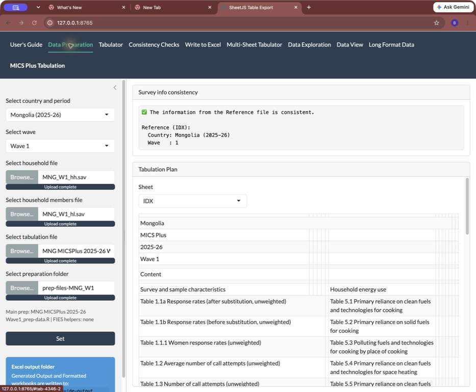
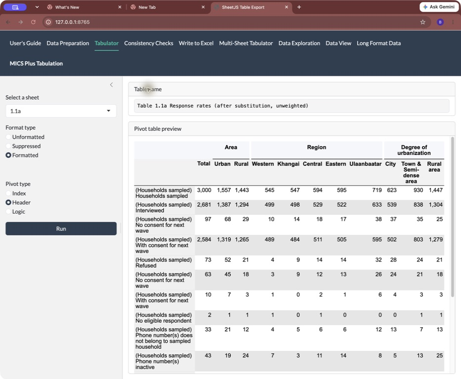
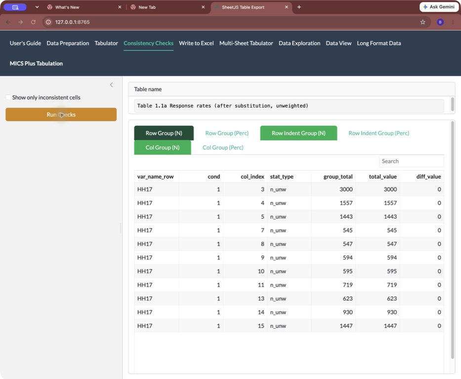
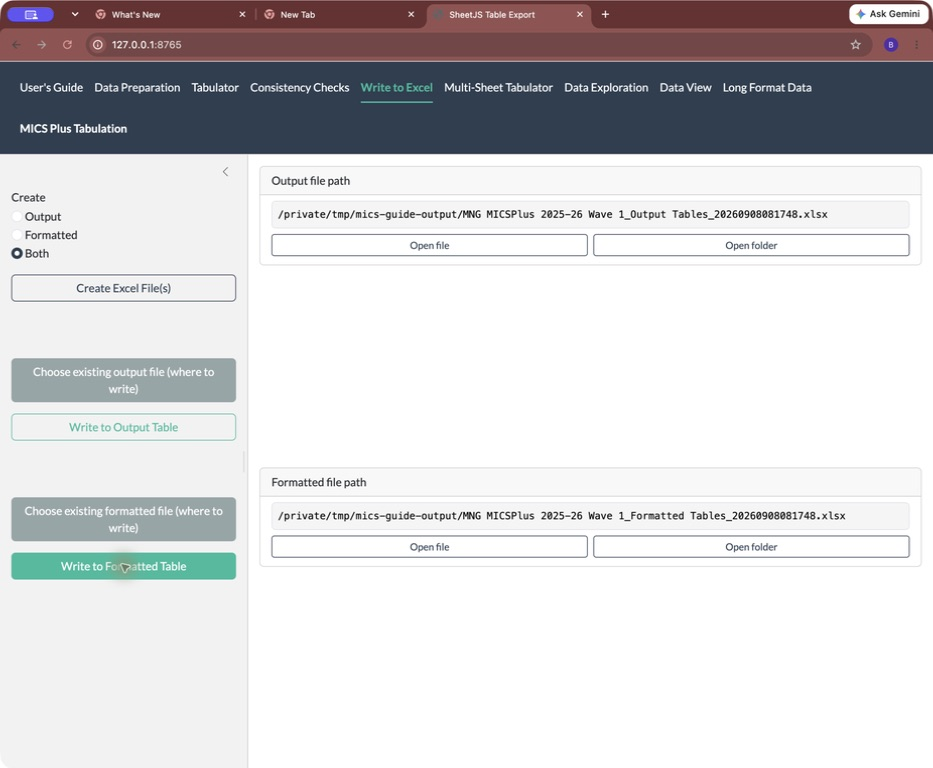
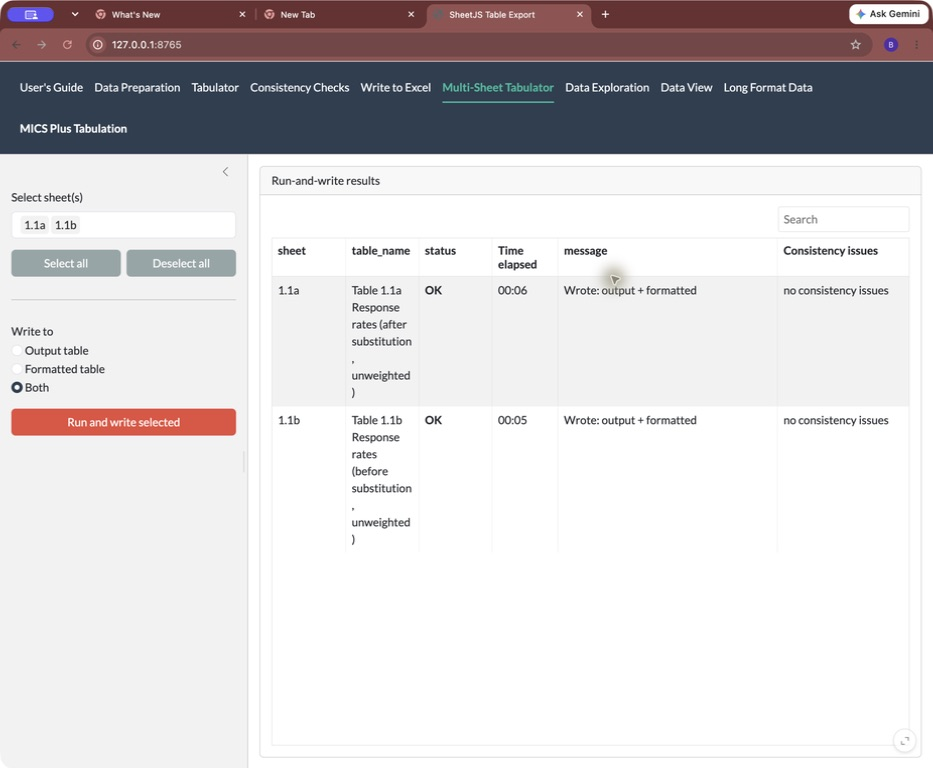
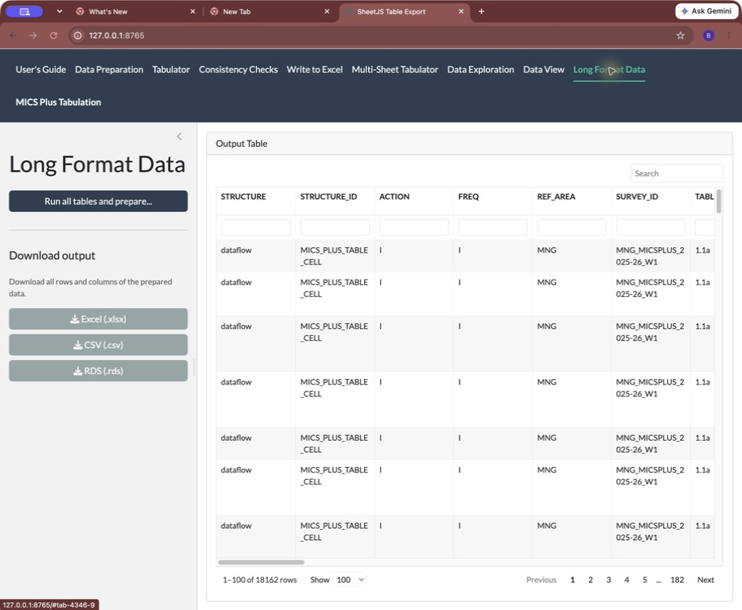
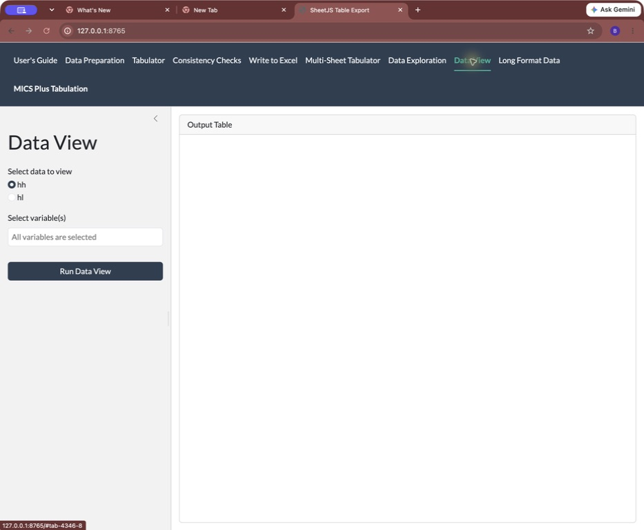
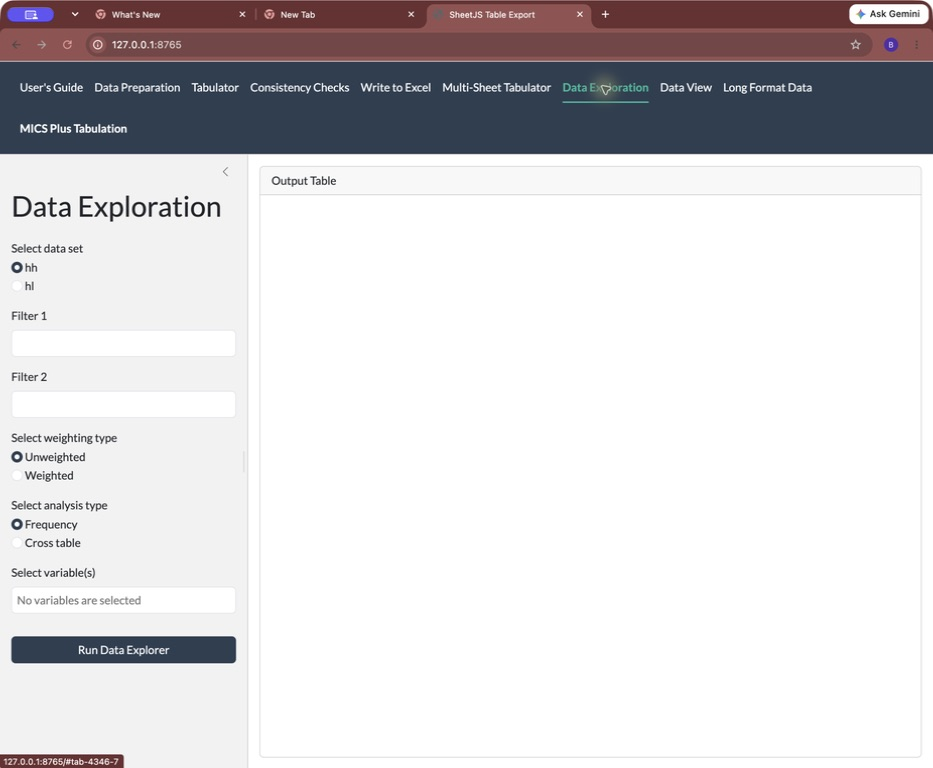

# Start here

::: {.content-visible when-format="html"}
[Download the printable PDF guide](user-guide.pdf).
:::

This guide helps you turn the files supplied by your survey team into Excel
tables. You do not need to write calculations or change computer code.
Follow one step at a time. Ask your survey lead for help if a file or a result
is different from what you expect.

**Your route through the application**

1. **Data Preparation** - choose the files for your survey.
2. **Tabulator** - calculate one table.
3. **Consistency Checks** - check that its totals agree.
4. **Write to Excel** - save the reviewed table.

The later pages explain running several tables, downloading data, and optional
viewing tools. You can leave those until you have completed your first table.

**Words used in this guide**

- **Click:** press the left mouse button once. On a touchpad, tap once.
- **Tab:** a section name across the top of the application.
- **Browse:** open a window to find a file on your computer.
- **Folder:** a place that holds files. A preparation folder may contain smaller folders.
- **Sheet:** one page of an Excel workbook, such as `1.1a`.
- **Wave:** one round of the survey. Use the wave your team gave you.

**About the pictures.** These are actual application screenshots from version
0.2.7, using Mongolia Wave 1 as an example. Your file names and results will
differ. Use the files for your own survey. Screenshots show a temporary example
output folder; your project normally saves to **micsPlusTableR-output**.
In the HTML guide, click a picture to enlarge it; press **Esc** to return.
In the PDF, use your reader's zoom control if small labels are hard to read.

**Looking for package functions?** Use the
[package reference manual](https://github.com/bariscr/micsPlusTableR/blob/HEAD/output/pdf/micsPlusTableR-manual.pdf)
and [package documentation](https://github.com/bariscr/micsPlusTableR#readme).
Those documents cover programming and technical details.



# 1. Open the application

## The first time: ask a support person to help

Your computer needs **R**, **RStudio**, and a web browser. Ask your support
person to install them and give you a survey project folder. You need internet
access to install the application package from GitHub.

1. Open your survey project folder in **File Explorer** on Windows or **Finder**
   on a Mac. Double-click its file ending in **.Rproj** to open RStudio.
2. Find the panel named **Console**. Click beside the `>` prompt.
3. Copy the first line below into the Console and press **Enter** (**Return**
   on a Mac). Wait for the `>` prompt to return. Then run the second line and
   wait again:

```r
install.packages("remotes")
remotes::install_github("bariscr/micsPlusTableR")
```

4. If installation asks a question or reports an error, ask your support person
   to help before continuing.
5. When installation finishes, click **Session**, then **Restart R** at the top
   of RStudio.

## Each time you work

1. Open your survey's **.Rproj** file as above.
2. In the **Console**, paste this line and press **Enter**:

```r
micsPlusTableR::run_app()
```

3. The application opens in a browser. Click **Data Preparation** at the top
   if it is not already selected. The next page lists the files you will need.

**You are ready when:** you can see **Data Preparation**, **Tabulator**,
**Consistency Checks**, and **Write to Excel** across the top. Click
**User's Guide** to read these instructions inside the application. Use
**Open full guide** there if you want a separate browser tab.

**While working:** keep RStudio and the application open. A busy Console without
 a `>` prompt is normal while the app runs. Do not paste more commands there.
Do not refresh the browser; you may lose work not yet written to Excel.

**No browser window?** Find the address beginning `http://127.0.0.1:` in the
Console. Copy the complete address into your browser's address bar and press
**Enter**. The number at the end can change each time you start.

Install again only when your survey lead asks you to update. For installation
help, show your support person the Console message and the
[package setup instructions](https://github.com/bariscr/micsPlusTableR#install-and-run).



# 2. Gather your survey files

Ask your survey lead for these **four items for the same country, period, and
wave**. Keep them together in a folder you can find again.

| Item to obtain | How to recognize it | Where it goes in the app |
|---|---|---|
| Household data | Name often ends in `hh.sav` | **Select household file** |
| Household members data | Name often ends in `hl.sav` | **Select household members file** |
| Tabulation plan | Excel file ending in `.xlsx` | **Select tabulation file** |
| Preparation folder | Folder containing the team's preparation file | **Select preparation folder** |

Your team may supply longer names. Do not rename the files just to match the
pictures. You do not need to open the `.sav` files or the preparation code.

## How to choose a file

1. Click **Browse...** beside the relevant item in the application.
2. In the window that opens, find the folder your team gave you. If it was
   downloaded, first look in **Downloads**.
3. Double-click a folder to open it. Click the required file once to select it.
4. Click **Open**. Wait until its name appears in the application and the upload
   finishes. Repeat for the other files.

## How to choose the preparation folder

1. If the team supplied a ZIP file, extract it first: on Windows, right-click
   it and choose **Extract All**; on a Mac, double-click it.
2. Beside **Select preparation folder**, click **Browse...**.
3. Select the folder that contains the preparation file, then click **Upload**,
   **Select**, or **Open**, depending on your browser. Select the folder itself,
   rather than an individual file inside it.
4. If the browser asks to upload the folder's files, check its name and confirm.

**Check before continuing:** use the complete preparation folder supplied by
your team. Keep any folders inside it, such as **FIES-inputs**, in place.
If you cannot tell which files belong together, ask your survey lead.



# 3. Choose the files and click Set

{fig-alt="Data Preparation screen with Mongolia 2025-26 Wave 1 selected, four inputs loaded, Set at lower left, and a successful survey consistency message at upper right." fig-pos="H" width="100%"}

1. Click **Data Preparation**. Under **Select country and period**, click the
   small arrow and choose your survey. Choose the matching **wave** below it.
2. Use the four **Browse...** controls as described on the previous page.
3. Read **Main prep** below the folder control. Check that it names your team's
   preparation file. **FIES helpers: none** is normal for surveys without FIES.
4. Click **Set** once. If it is below the visible area, scroll down inside the
   left panel. Wait for preparation to finish.
5. Read **Survey info consistency** at the upper right. Check the country,
   period, and wave. The example says the reference information is consistent.

**Ready to continue:** the survey details agree and there is no preparation
error. A matching survey message alone does not resolve a separate error.
If a mismatch or error appears, check your choices or ask your survey lead.



# 4. Calculate and look at one table

{fig-alt="Tabulator screen with sheet 1.1a, Formatted and Header selected, Run at left, and a calculated response-rate table at right." fig-pos="H" width="100%"}

1. Click **Tabulator** at the top.
2. Under **Select a sheet**, click the arrow. Choose the table code requested
   by your survey lead. The picture uses **1.1a**.
3. Leave **Format type** on **Formatted** and **Pivot type** on **Header** for
   an easy-to-read preview.
4. Click **Run** once and wait for the table to appear.
5. Read **Table name** above the result. Check that it is the table you intended
   to produce. Scroll inside the preview to see more rows or columns.

**Ready to continue:** the correct table name and calculated values appear.
The next step is **Consistency Checks**. A preview has not yet saved your
calculated table to an Excel file.

If your reviewer asks for plain numbers, choose **Unformatted**. Choose
**Suppressed** to inspect the small-sample display rules. Keep **Header**
selected unless your reviewer asks for another view.



# 5. Check the table

{fig-alt="Consistency Checks screen with Run Checks on the left and a Row Group N result showing matching totals and zero differences on the right." fig-pos="H" width="100%"}

1. Click **Consistency Checks**. Confirm the **Table name** matches the table
   you just ran.
2. Click **Run Checks** and wait for the results.
3. Click each of the smaller check tabs, such as **Row Group (N)**. They compare
   counts or percentages in different parts of the table.
4. If a tab is red, tick **Show only inconsistent cells** to find the differences.
   Record the table code and ask your survey lead to review them.

**Green:** this check ran and found no difference beyond its tolerance.
**Red:** a difference needs review.
**No color or no rows:** the check may not apply; it does not mean it passed.
Read the result as well as the color. The example's **diff_value** column shows
zero where the compared totals agree.

**Ready to continue:** the applicable checks pass, or the survey lead has
reviewed and accepted any exceptions. Passing checks do not replace the
survey lead's review of the table and its meaning.



# 6. Save the reviewed table to Excel

{fig-alt="Write to Excel screen showing Both, Create Excel Files, two write buttons, and Output and Formatted file paths with Open file and Open folder buttons." fig-pos="H" width="100%"}

1. Click **Write to Excel**. Under **Create**, choose **Both** unless your survey
   lead requests one type only.
2. Click **Create Excel File(s)** **once for this run**. Two file paths appear
   on the right. This creates workbook copies; it does not fill every table.
3. Click **Write to Output Table**. Wait for the write to finish.
4. Click **Write to Formatted Table**. Wait again. Both buttons write the
   **current table** to its matching sheet.
5. Under **Formatted file path**, click **Open folder** to find the saved file,
   or **Open file** to view it. Check the expected sheet in Excel.

**Output** keeps numeric values for review. **Formatted** contains the table's
presentation values and applicable notes. Close the workbook in Excel before
writing another table. If **Open folder** does not work, copy the displayed
folder path into File Explorer or Finder.

**Next table:** repeat **Tabulator > Run**, **Consistency Checks > Run Checks**,
then the two **Write** buttons. Reuse the same workbooks; do not click
**Create Excel File(s)** again for every table.



# 7. Run several tables together (optional)

{fig-alt="Multi-Sheet Tabulator showing selected table codes, the Both write target, Run and write selected, and results for the selected sheets." fig-pos="H" width="100%"}

Use this after you can run and review one table successfully.

1. First create your workbook files in **Write to Excel** (step 6), if you have
   not already done so for this run.
2. Click **Multi-Sheet Tabulator**. Click **Select sheet(s)** and choose a table.
   Click again to add another. Use **Deselect all** to clear the selection.
3. Under **Write to**, choose **Both** or your agreed destination.
4. Click **Run and write selected** once. Keep RStudio and the browser open
   until it finishes.
5. When the completion message appears, click **OK**. Read every row in
   **Run-and-write results**, especially **status**,
   **message**, and **Consistency issues**. Use the horizontal scrollbar if
   a column is off the right edge.

**Ready to continue:** every requested table has completed and its results have
been reviewed. This action writes tables as it runs; it does not wait for your
review of each table. A completed write is not approval of a flagged result.

If a table fails or has consistency issues, note its code and message. Review
it separately with your survey lead before sharing the workbook. Start with a
small selection; use **Select all** only when you are ready for the full run.



# 8. Download a data file (optional)

{fig-alt="Long Format Data screen with Run all tables and prepare on the left and Excel, CSV, and RDS download controls below it, beside the preview on the right." fig-pos="H" width="100%"}

Use this only if your survey lead asks for the tables as a combined data file.
For ordinary presentation tables, use **Write to Excel** instead.

1. Complete **Data Preparation** first.
2. Click **Long Format Data**.
3. Click **Run all tables and prepare...**. Wait while the application calculates
   the tables. This may take longer than running one table.
4. When the data preview appears without an error, find **Download output**
   in the left panel. Click **Excel (.xlsx)** for
   a spreadsheet, or the format your recipient requested.
5. Find the file in your browser's **Downloads** list or your computer's
   **Downloads** folder. Some browsers ask you to choose a save location.

**What you receive:** one combined file of calculated table cells. It is a
different layout from the **Formatted** workbook. **CSV (.csv)** is a plain
text table; **RDS (.rds)** is for someone working in R.

The download contains all prepared rows, including rows hidden by preview
filters or pages. Check the country, period, and wave in the filename before
sending it. If preparation reports a failed table, ask your survey lead to
resolve the error and rerun before relying on a download.



# 9. Look at prepared data (optional)

{fig-alt="Data View screen showing dataset and variable selectors and Run Data View, with the preview area on the right." fig-pos="H" width="100%"}

This tool shows the data after preparation. Use it when your survey lead asks
you to check a particular item. A **variable** is a named item in the data,
like age or region.

1. Complete **Data Preparation**, then click **Data View**.
2. Under **Select data to view**, choose **hh** for households or **hl** for
   household members, as directed by your reviewer.
3. Select the variable names your reviewer gives you.
4. Click **Run Data View**. Read the preview and its labels.

**Check:** you are looking at the intended dataset and variables. This screen
may show individual survey records. Share only what your survey team's data
handling rules allow, and avoid including records in a help screenshot.

You can return to **Tabulator** by clicking its tab at the top. Viewing data
here does not save a presentation table to Excel. The picture shows the
controls before any individual records are displayed.



# 10. Explore a question (optional)

{fig-alt="Data Exploration screen with dataset, weighting, variable and analysis controls on the left and the analysis preview area on the right." fig-pos="H" width="100%"}

Use this for a question your survey lead wants to investigate. It does not
replace the approved tabulation plan.

1. After **Data Preparation**, click **Data Exploration**.
2. Under **Select data set**, choose **hh** for households or **hl** for household
   members. Under **Select variable(s)**, choose the names your reviewer gives you.
3. Choose **Unweighted** or **Weighted**, as your reviewer specifies. If weighted,
   enter their exact variable name in **Type weight variable**. Do not guess it.
4. Choose **Frequency** to count categories of one variable, or **Cross table**
   to compare two variables. Select the second variable if requested.
5. Leave any filter box blank unless your reviewer supplies the exact text to
   use. Click **Run Data Explorer** and read the result.

**Check:** the selected data, variables, and weighting match the question you
were asked to explore. These choices can change the meaning of a result.
Ask your reviewer before treating it as a final survey finding.



# 11. Finish, return later, or get help

## Finish your work

1. Write every reviewed table you want to keep to Excel (step 6).
2. Find the saved workbook. Open it and check the country, wave, and expected
   sheets. Keep your review notes with it.
3. Close the workbook, then close the application's browser tab.
4. In RStudio, click the red **Stop** button in the Console to stop the app.
   You may then close RStudio. Saving an R workspace is not a substitute for
   saving the Excel workbooks.

**When you return:** start the app again and select your inputs again. The app
does not automatically restore the previous browser session. For a fresh run,
create new workbook files. To continue an existing workbook, ask your survey
lead to help select it using the **Choose existing...** buttons in **Write to
Excel**. Writing the same sheet again replaces its previously written values.

## If something goes wrong

| What you see | What to do next |
|---|---|
| Missing file or wrong filename | Return to **Data Preparation**, select the correct file, and click **Set** again. Rerun and recheck the table. |
| Country or wave mismatch | Compare your dropdown choices with the files supplied by your team. Ask for a matched set if unsure. |
| Preparation error or missing variable | Record the message and send it to your survey lead. Do not edit the preparation code yourself. |
| Empty preview or no table | Check that **Set** completed, choose a sheet, and click **Run**. If the workbook preview alone is blank, check your connection and report that detail. |
| Red consistency tab | Record the table code and the displayed differences. Have your survey lead review them before sharing. |
| Excel file cannot be written | Close that workbook in Excel, then try its **Write** button again. |
| Cannot find the saved workbook | Use **Write to Excel > Open folder** or the path shown there. For a data download, check **Downloads** instead. |
| Browser disconnected or refreshed | Save any work still available. Restart the app if needed and select the inputs again; check existing files before rewriting. |

**When asking for help, include:** country and wave, table code, the button you
clicked, and the exact error text. A screenshot of the message helps; leave
individual survey records out of it. Your support person can check the installed package
version in RStudio.
