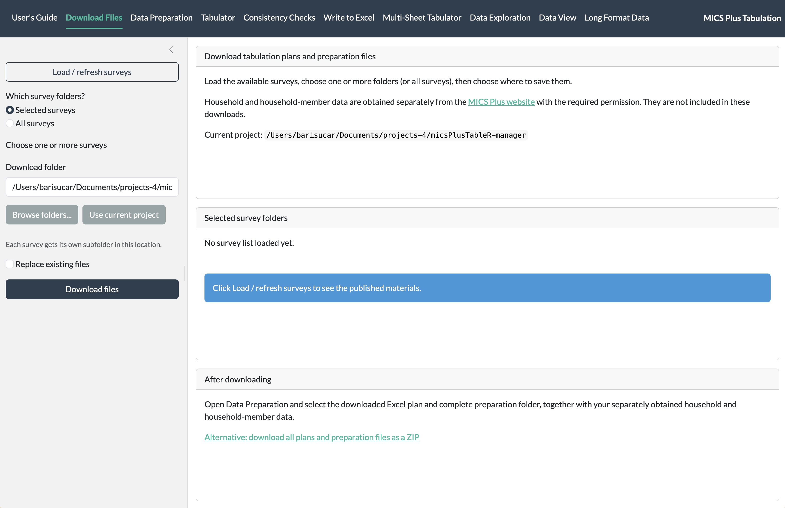
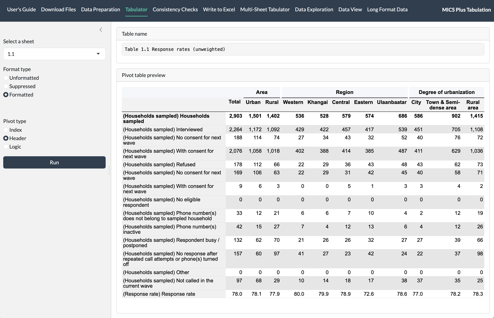
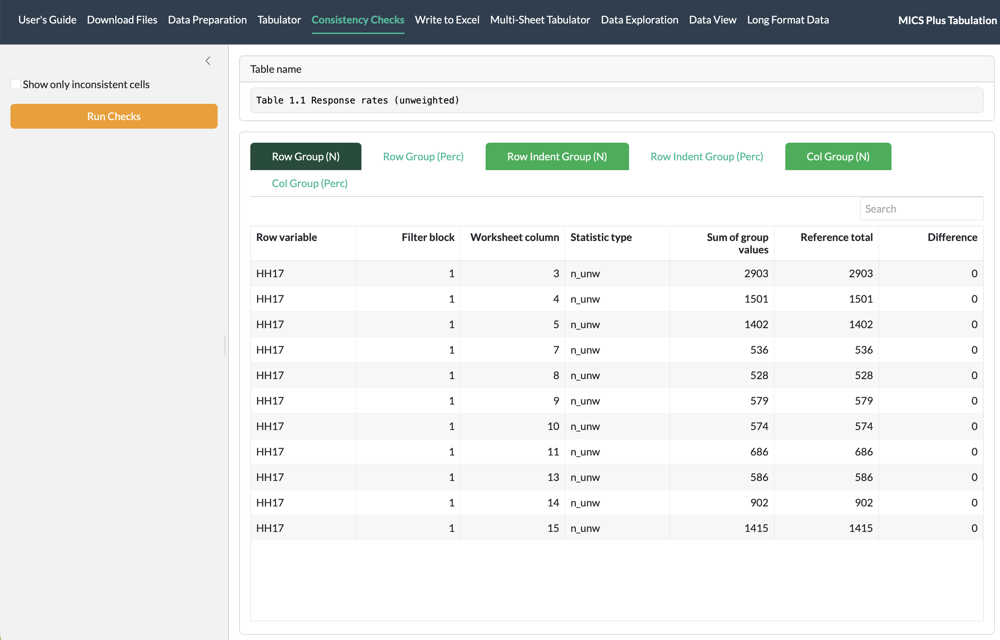
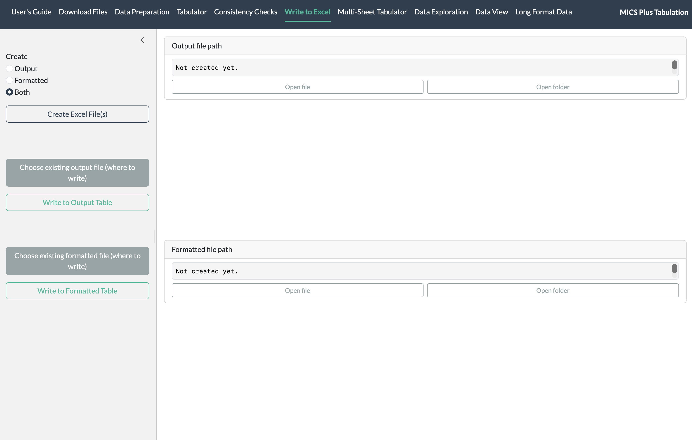
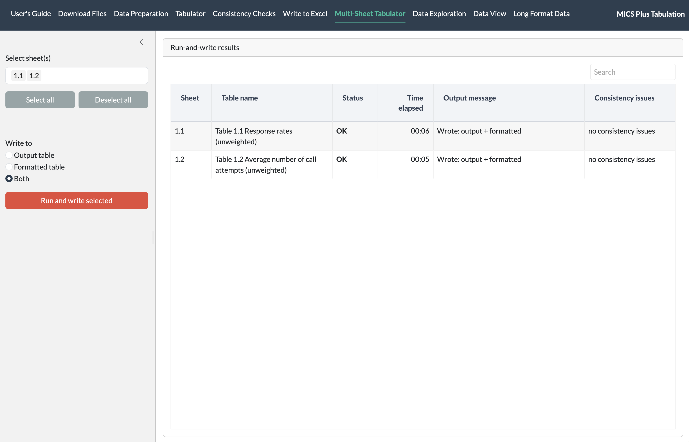
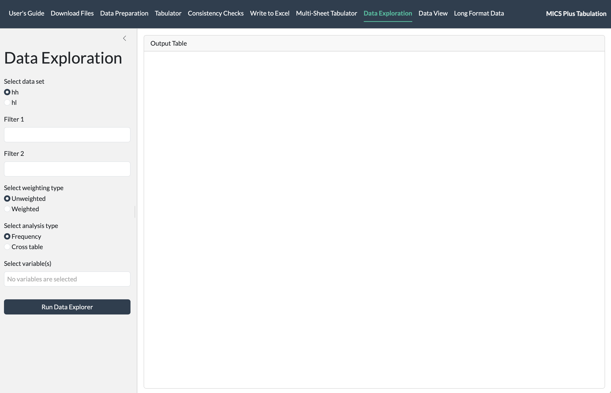
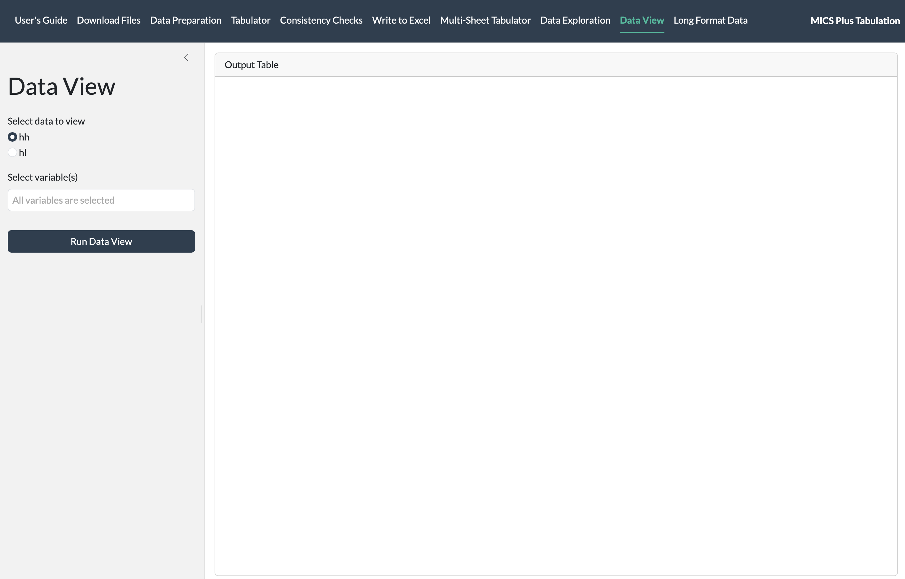
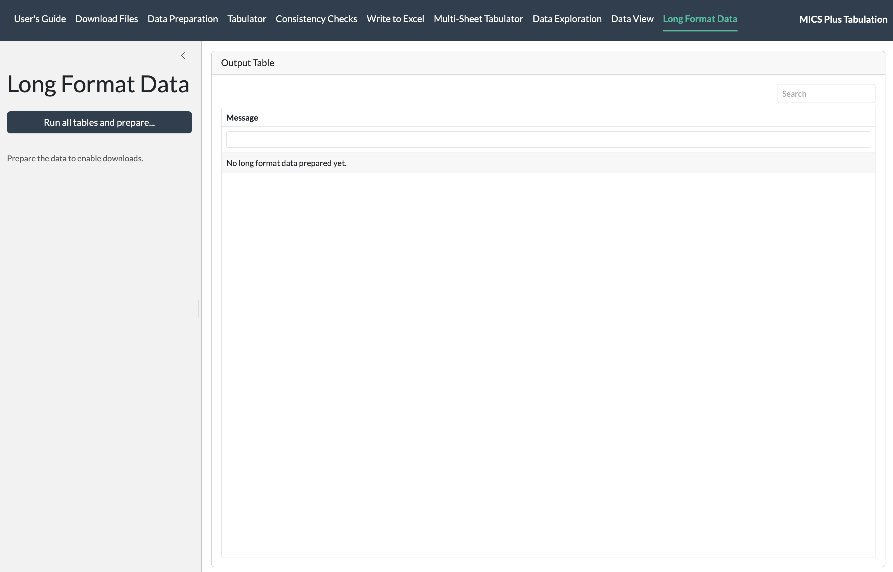

# About micsPlusTableR {#about-system}

::: {.content-visible when-format="html"}
[Download the printable PDF guide](user-guide.pdf).
:::

micsPlusTableR is the R package behind the **MICS Plus Tabulation**
application. It was created primarily to support this browser-based app
for preparing, tabulating, reviewing, and exploring survey data. R
performs the calculations; the app provides controls for selecting
inputs, running analyses, and examining results.

Most other package functions perform background tasks for the app or
expose its calculation engine. They are documented for understanding the
system, testing, and working directly in R. You do not need to call them
individually when using the app.

**Purpose.** The system connects the tables you want to produce with the
data and preparation steps needed to calculate them. A tabulation plan
(Excel) records the table definitions, while a survey-specific R script
prepares the data and variables. This makes it possible to apply a
supplied plan or create and adapt a plan for your own reporting and
analysis needs, then repeat the calculations when inputs or
specifications change.

**Inputs.** The application uses four matching inputs for a survey:

- **Household data**, supplied as an SPSS `.sav` file.
- **Household-member data**, supplied as a separate SPSS `.sav` file.
- **A tabulation plan (Excel)**, specifying table layouts, row and
  column groups, conditions, statistics, and display settings.
- **A preparation folder**, containing the R script and any supporting
  files needed to prepare the data used by the plan.

**Features.** You can obtain supplied plans and preparation materials,
prepare survey data, calculate a selected table, review consistency
checks, and run several tables together. The application also lets you
inspect prepared data, explore frequencies and cross-tabulations, and
combine calculated table cells into a data file for further use.
Worksheet filters, weights, statistics, and display settings control the
tables you define.

**Results and outputs.** Choose the form that serves your task:

- **Results in the application:** table previews, check results,
  prepared data views, and exploratory analyses. Looking at a table in
  Tabulator may be all you need; writing it to Excel is not required.
- **Excel table workbooks:** save calculated tables in their worksheet
  layouts for review, reporting, or sharing.
- **Combined table data:** download calculated cells in Excel, CSV, or
  RDS format for further analysis or exchange.
- **R objects:** use the package functions in a scripted workflow.

These are different ways to use the system, not a single sequence that
must end in an export. Choose the relevant tools after preparing your
inputs. Save or download results when you need to retain them beyond the
current app session.



# Ways to use the system {#ways-to-use}

Choose the route that matches how you obtain or develop your table
definitions. Either route can support viewing results in the app,
reviewing them, or producing files.

**Two main routes**

1.  **Run an existing tabulation plan.** Use the plan and preparation
    files supplied by the MICS team or your survey team, together with
    the corresponding data. This route is for users producing tables
    from an agreed specification. You can run, check, and export the
    tables without writing calculations or changing the preparation
    code.

2.  **Create or adapt a tabulation plan.** Design the tabulation plan
    for the tables you need, then apply it with a compatible preparation
    script and the corresponding data. This route is for plan authors
    and analysts who define row and column groups, statistics, filters,
    weights, and display settings. Use an existing working plan as a
    starting point where possible, keeping the worksheet structure the
    app expects. Check that variables used by the plan are available
    after preparation. If new or changed variables are needed, update
    the preparation script with the person responsible for that code.

**Different users, shared checks.** Table producers can use the app
instructions for the tasks they need. Anyone who wants to understand how
a table is created can use [Understand the tabulation
plan](#worksheet-reference), whether reading an existing plan or editing
one. Reviewers can focus on the plan's definitions, calculated results,
consistency checks, and exported tables. Users maintaining preparation
scripts or running the workflow directly in R can use the package
reference linked under [Terms and reference information](#guide-terms).
One user may take several of these roles.

After changing a plan or preparation script, load the updated inputs and
rerun the affected tables and checks. Users can move between table
production, plan development, and data exploration as their work
requires.



# Find the task you need {#guide-contents}

The entries below cover the whole guide and link to its sections. The
numbers help you find instructions; they do not mean every task must be
completed. Set up the system and prepare the inputs you need, then
choose the tools that serve your purpose.

**Set up the system and inputs**

1.  [**Set up your computer**](#computer-setup) - install R and an
    editor such as RStudio.
2.  [**Create or open a survey project**](#survey-project) - choose
    where your work belongs.
3.  [**Install the package and start the app**](#install-and-start) -
    install micsPlusTableR in R, open the app in your web browser, and
    [use the User's Guide tab](#using-guide).
4.  [**Gather your survey files**](#survey-files) - obtain or prepare a
    compatible plan, preparation script, and survey data.
5.  [**Load and prepare your data**](#data-preparation) - load your
    inputs and prepare the data.

**Calculate, review, explore, and save results**

6.  [**Calculate and look at one table**](#calculate-table) - use
    Tabulator to calculate a worksheet and inspect its result.
7.  [**Check the table**](#check-table) - compare related counts and
    percentages with Consistency Checks.
8.  [**Save the reviewed table to Excel**](#save-excel) - write a table
    when you need a saved workbook.
9.  [**Run several tables together**](#multiple-tables) - calculate and
    write selected sheets, then review the run summary.
10. [**Explore a question**](#explore-data) - examine frequencies or
    cross-tabulations with Data Exploration.
11. [**Look at prepared data**](#view-data) - inspect selected household
    or household-member variables in Data View.
12. [**Download a data file**](#table-data) - combine calculated table
    cells in Long Format Data and download them as Excel, CSV, or RDS.

**Manage your session**

13. [**Finish, return later, or get help**](#finish-and-help) - retain
    any results you need, close or reopen the app, and troubleshoot.

**Reference sections**

- [**Understand the tabulation plan**](#worksheet-reference) - locate
  datasets, prepare conditions for the intended outputs, and choose
  statistics and display settings. See [row and column conditions](#worksheet-conditions)
  for total aliases and household-member bases.
- [**Other editors and code systems**](#other-environments) - use the
  package with an R environment other than RStudio.
- [**Terms and reference information**](#guide-terms) - find
  definitions, notes about the screenshots, and links to the package
  reference.



# 1. Set up your computer {#computer-setup}

## Choose where to run R

**If you are new to R, follow the RStudio Desktop steps below.** R does
the calculations; RStudio gives you a window in which to start them.
These are two separate programs. The tabulation application then runs in
your web browser. You only need to copy a few commands; the table-making
steps use buttons.

An **IDE** is a program that brings together tools for working with
code. The package can run in an R session started from different editors
and code systems. You only need one of these options:

| Option | What you need to know |
|----|----|
| **RStudio Desktop** | The route explained here, with an R Console and a project menu. Install R separately. |
| **Positron** | An alternative with built-in R support. Install R, open your survey folder, and choose an R session. |
| **Visual Studio Code (VS Code)** | Install R and configure the R extension; run the commands in an R terminal. |
| **Cursor** | Use its code editor with R installed and a compatible R extension, or start R in its terminal. |
| **JupyterLab / Jupyter Notebook** | Use an R kernel, such as IRkernel. This requires extra setup. |
| **R's own console / a terminal** | Run the same R commands from your survey folder. No separate IDE is required. |

For setup details, see [Positron's R
guide](https://positron.posit.co/guide-r.html), [VS Code's R
guide](https://code.visualstudio.com/docs/languages/r), [Cursor's
extension guide](https://prod.cursor.com/help/customization/extensions),
and [IRkernel for Jupyter](https://irkernel.github.io/installation/).
The [other environments](#other-environments) section explains project
folders and browser access for these routes. The remaining
click-by-click computer setup instructions use RStudio Desktop.



## Install R, then RStudio Desktop (once)

If both programs already open on your computer, go to [Create or open
your survey project](#survey-project). You need internet access for
installation. Use a recent R version supported by your editor; the
package requires **R 4.2 or later**. You also need a web browser and an
Excel viewer to review the saved workbooks. The workbook preview may
also need internet when the app opens; see [Internet access and the
workbook preview](#workbook-preview-internet) for the role of browser
caching.

### Install R first

1.  Open your web browser and go to the [official R download
    site](https://cloud.r-project.org/).
2.  **Windows:** click **Download R for Windows**, then **base**, then
    the download link for R. Open the downloaded `.exe` file from
    **Downloads**. Follow the installer, using its standard options, and
    click **Finish**.
3.  **Mac:** click **Download R for macOS**. Choose the `.pkg` installer
    matching your Mac and macOS version. **Apple menu \> About This
    Mac** shows whether your Mac has an Apple chip or an Intel
    processor. Open the downloaded file and follow the installer.
4.  **Linux:** follow the R download page's instructions for your Linux
    distribution.

### Install RStudio Desktop next

1.  Go to [Posit's RStudio Desktop download
    page](https://posit.co/download/rstudio-desktop/). Choose the **free
    RStudio Desktop** download for your operating system.
2.  **Windows:** open the downloaded installer and follow its steps.\
    **Mac:** open the downloaded `.dmg` and drag RStudio into
    **Applications**.\
    **Linux:** use the installer and instructions for your distribution.
3.  Open **RStudio** from the Windows **Start** menu or Mac
    **Applications**. If it asks you to choose R, select the version you
    just installed.
4.  Find the **Console** panel. When you see a `>` prompt, R is ready.

**Ready to continue:** RStudio opens and its Console shows `>`. If you
see “R not found,” finish installing R, close RStudio, and reopen it. If
your computer requires an administrator password you do not have, ask
your IT support person to complete the installation.



# 2. Create or open your survey project {#survey-project}

**Do this before starting the application.** Create or open a project
folder for your survey work. It keeps your files and generated results
together. Choose the appropriate route below and use a memorable name,
such as **Mongolia-Wave1**; substitute your own survey.

## New work: create a new project folder

1.  In RStudio, click **File \> New Project**.
2.  Choose **New Directory**, then **New Project**.
3.  Under **Directory name**, enter your survey project name.
4.  Beside **Create project as subdirectory of**, click **Browse** and
    choose a location you can find again, such as **Documents**.
5.  Click **Create Project**. RStudio creates and opens the folder.

## You already have a folder, but no .Rproj file

1.  Click **File \> New Project \> Existing Directory**.
2.  Click **Browse** and choose your existing survey folder.
3.  Click **Create Project**. RStudio adds a project file to that
    folder; your existing survey files stay in place.

## You already have an RStudio project

1.  Click **File \> Open Project**.
2.  Find your survey folder, select its **.Rproj** file, and click
    **Open**. You can also double-click that file in File Explorer or
    Finder.

These routes follow the [RStudio project
instructions](https://docs.posit.co/ide/user/ide/guide/code/projects.html).
To switch surveys later, stop the app and use **File \> Open Project**
again.

**Check your location:** the project name should appear at the top right
of RStudio.

**Your files:** keep your supplied survey data, tabulation plan, and
complete preparation folder inside an **inputs** subfolder if
convenient. Copying files into the project does not load them into the
app; you will select them with **Browse** during [Data
Preparation](#data-preparation). Files may also remain in another
accessible folder. Keep the project available while working; extract ZIP
folders first if you downloaded the inputs as ZIP folders.

The app normally creates **micsPlusTableR-output** inside your project
for Excel results. Browser downloads may go to **Downloads** instead.
The **Write to Excel** screen shows the actual saved workbook paths.



# 3. Install the package and start the app {#install-and-start}

## Install the micsPlusTableR package (once) {#package-setup}

1.  Keep your survey project open. Click the **Console** beside `>`. Use
    the **Console**, rather than the **Terminal** tab or a search box.
2.  **Install `remotes` only if it is not already available in your R
    library. Once installed, you do not need to install it again:** skip
    the first line on later uses. Run the second line to install
    **micsPlusTableR**. Paste each needed command into the Console and
    press **Enter**. Wait for `>` to return before running the next
    command:

``` r
install.packages("remotes")
remotes::install_github("bariscr/micsPlusTableR")
```

`remotes` is the helper that installs the application package from
GitHub. The second command installs **micsPlusTableR** and its required
packages, including those used by the supported survey preparation
scripts. This may take several minutes. Leave RStudio open while
messages scroll.

3.  If R asks to create a personal library, accept it. If asked to
    choose a CRAN download mirror, choose **0-Cloud** if offered. If a
    menu lists packages with newer versions, enter the number for your
    choice and press **Enter**:

    - **All:** update all packages listed in that menu. Choose this when
      setting up a new working environment or when you want to bring the
      listed packages up to date and have time to check your work with
      the updated versions. Installation may take longer.
    - **None:** keep the versions already installed. Choose this when
      your current setup works and you want to keep those versions while
      continuing an analysis. Required packages that are missing will
      still be installed.

    **All** refers to the packages listed for this installation, not
    every package available for R. If installation reports that a named
    package is too old, update that package, or choose **All** to update
    all listed packages, then retry. You do not need to update
    everything to resolve a problem with one package. See the
    [package-update
    guidance](https://remotes.r-lib.org/reference/install_github.html).

4.  If an error appears, copy the message and ask your IT support for
    help. For folder or lock errors, see [Installation cannot
    finish](#installation-cannot-finish).

You normally install once for the R library you use, not once per survey
or on every launch. A different R installation or an isolated project
library may need its own package installation. To update, finish and
save your work and stop the app. Run the GitHub installation command
again, choose package updates as described above, and restart R before
using the updated package.



## Start the application (each time you work) {#start-application}

1.  Open your survey project in either of these ways: double-click its
    **.Rproj** file in File Explorer or Finder, or in RStudio choose
    **File \> Open Project**, select the **.Rproj** file, and click
    **Open**. Confirm the project name at the top right of RStudio. You
    do not need to repeat installation for ordinary launches.
2.  In the **Console**, paste this line and press **Enter**:

``` r
micsPlusTableR::run_app()
```

3.  The application opens in a browser on **Data Preparation**. On a
    narrow window, use **Toggle navigation** to see the tabs. If you
    need plans or preparation files, open **Download Files**.
4.  [Gather your survey files](#survey-files), then use [Data
    Preparation](#data-preparation) to select the country and wave,
    upload the files, and click **Set**.

**You are ready when:** you can open **Download Files**, **Data
Preparation**, **Tabulator**, **Consistency Checks**, and **Write to
Excel** across the top.

**While working:** keep RStudio (or your chosen R environment) and the
application open. A busy Console without a `>` prompt is normal while
the app runs. Do not paste more commands there. Do not refresh the
browser; you may lose work not yet written to Excel.

**No browser window?** Find the address beginning `http://127.0.0.1:` in
the Console. Copy the complete address into your browser's address bar
and press **Enter**. The number at the end can change each time you
start.

**Where the work happens:** with this local setup, the browser connects
to R on your computer. Selecting input files loads them into the running
app; it does not install them into the package. Opening a project later
does not restore the app's uploaded inputs or unsaved results.

If the app does not start, read the Console message and check the
[package setup instructions](#package-setup). Include the complete
message when requesting technical help.



## Use the User's Guide tab {#using-guide}

**User's Guide** is the first tab in the app's navigation bar. Open it
at any point to read the instructions while keeping the app open.

- Read the guide inside the tab and use **Find the task you need** to
  jump to a section.
- Click **Open full guide** to open the guide in a separate browser tab.
  This lets you keep the instructions beside the app while you work.
- Click **Download PDF** to save a copy for offline reading or printing.
  Find it in your browser's downloads or the download location you
  chose.

Return to the relevant app tab to continue your work. Opening the guide
does not reset your inputs or results. The app sections in this guide
follow the navigation bar: **Download Files**, **Data Preparation**,
**Tabulator**, **Consistency Checks**, **Write to Excel**, **Multi-Sheet
Tabulator**, **Data Exploration**, **Data View**, then **Long Format
Data**. You can use each tool when you need it; this order is not a
requirement to complete every tab.



## Internet access and the workbook preview {#workbook-preview-internet}

**Why the preview uses a browser library.** The workbook preview in
**Data Preparation** shows the uploaded tabulation plan (Excel) inside
the app. A browser cannot display an Excel workbook as a table on its
own, so the app uses a JavaScript library called **SheetJS** to read it
and convert the selected sheet into a displayable table. You do not need
to install this library yourself. It is separate from the calculations
performed by R and the calculated table preview in **Tabulator**.

**When internet is needed.** When the app opens, the browser loads
SheetJS from **cdn.jsdelivr.net** if it cannot reuse a saved copy. In a
local RStudio session, the workbook itself is read from the running app
on your computer; the preview code does not send it to that external
server. Once the library has loaded, changing the preview sheet does not
require downloading the library again while that app page stays open.

**What caching means for later use.** The browser may keep a copy of the
library in its cache and reuse it on later visits, avoiding another
download. However, caching is **not a guarantee of offline access**: the
copy can be cleared or expire, and another browser or a private window
may not have it. Browser settings can also require a new request. See
[how browser caching
works](https://developer.mozilla.org/en-US/docs/Web/HTTP/Guides/Caching).

**Before working offline:** open the app while connected, upload the
plan, and check that its workbook preview appears. Keep that app page
and R session open. Calculations and Excel output do not depend on
SheetJS; with the required packages and input files available locally,
they do not need this external download. Installation, **Download
Files**, and retrieving cloud-only inputs still need internet. If only
the workbook preview fails, you can inspect the plan in Excel and
continue tabulating.



# 4. Gather your survey files {#survey-files}

You need two sets of files for the **same survey (country, period, and
wave)**:

- **Household and household-member data (`.sav`):** obtain them from the
  [MICS surveys page](https://mics.unicef.org/surveys) with the required
  permission. These data are never distributed through this files
  repository or the package's download functions.
- **Tabulation plans and preparation files:** use a compatible set you
  have created or adapted, or download supplied materials from
  [micsPlusTableR-Files](https://github.com/bariscr/micsPlusTableR-Files)
  using the app or one of the alternatives below. These downloads
  require no GitHub account once the repository is public.

If your inputs are already available, go to [Check your input
set](#check-inputs). Otherwise, use one of the download routes below for
supplied plans and preparation files.

## Download with the app

Surveys are named by country, survey period, and wave, for example
**Jamaica (2023-24) Wave 1**. The download choices and survey folders
use the same names. Each survey contains its tabulation plan and a
`prep-files-` folder with the matching survey name. Keep the preparation
folder and its contents together.

1.  Open **Download Files** and click **Load / refresh surveys**.
    Internet access and a public files repository are needed to load the
    list.
2.  To download **one** folder, keep **Selected surveys** and tick that
    survey, such as `Jamaica (2023-24) Wave 1`. To download **several**,
    tick each survey you want. For **every** published survey folder,
    select **All surveys**.
3.  Review **Selected survey folders** for the file count and total
    size.
4.  Check **Download folder**. It starts at the current project you
    opened before launching the app. For example, selecting
    `Jamaica (2023-24) Wave 1` saves its materials in a
    `Jamaica (2023-24) Wave 1` subfolder directly inside that project.
5.  To choose another destination, click **Browse folders...**, select a
    folder, and click **Select**, or type a path. You may create a
    folder in the picker. A relative path such as `inputs` means a
    subfolder of the current project. **Use current project** restores
    the original default.
6.  Leave **Replace existing files** off to protect local copies. If the
    selected files already exist, use a different folder or turn it on
    deliberately.
7.  Click **Download files** and wait for the success message, which
    shows where the files were saved. The preparation subfolders are
    preserved.

Files are saved directly by R to the chosen location. They do not go
through your browser's **Downloads** folder. In a remotely hosted R
session, the path is on that remote machine; use your host's file access
tools to retrieve files.



## Download Files screen



This picture shows the screen before **Load / refresh surveys** is
clicked. Your own project path appears in **Download folder**. After
loading, the available survey checkboxes appear under **Choose one or
more surveys**.



## Alternative: download a ZIP through your browser

1.  Click [Download all plans and preparation files
    (ZIP)](https://github.com/bariscr/micsPlusTableR-Files/archive/refs/heads/main.zip).
2.  Find the ZIP in **Downloads**. On Windows, right-click it and choose
    **Extract All**; on a Mac, double-click it.
3.  Open the extracted `micsPlusTableR-Files-main` folder. Copy the
    survey folder you need, such as `Jamaica (2023-24) Wave 1`, into
    your survey project's **inputs** folder. Keep its preparation folder
    and all subfolders together.

## Alternative: download from the R Console

Open your survey project. Run these commands in the **R Console before
starting the app**. If the app is running, stop it first so the `>`
prompt returns. First list the available surveys:

``` r
available <- micsPlusTableR::list_survey_files()
unique(available$survey)
```

Choose **one** of these alternatives:

``` r
# One survey
micsPlusTableR::download_survey_files("Jamaica (2023-24) Wave 1")

# Several surveys
micsPlusTableR::download_survey_files(c(
  "Jamaica (2023-24) Wave 1",
  "Mongolia (2025-26) Wave 2"
))

# All published surveys
micsPlusTableR::download_survey_files()
```

The Console function defaults to **inputs** under `getwd()`, while the
app tab defaults to the project itself. Console downloads preserve the
survey and preparation subfolders. Use `dest_dir = "other-folder"` to
choose another destination. Existing files are protected: use a new
folder, or add `overwrite = TRUE` only when you intend to replace them.

For individual files, inspect `available$path` and pass the exact paths:

``` r
micsPlusTableR::download_survey_files(
  files = available$path[1],
  dest_dir = "selected-inputs"
)
```

Select a whole survey folder to include its preparation helpers. Add the
separately authorized household/member data before running the app. If
GitHub limits requests, retry later or use the ZIP link.



## Check your input set {#check-inputs}

Keep these **four items for the same country, period, and wave**
together in your survey project's **inputs** folder, or another folder
you can find again. The household and member files come from the MICS
Plus website with permission. Use a tabulation plan and preparation
folder supplied by your team or downloaded from `micsPlusTableR-Files`,
or your own compatible versions. Once all four items are ready, continue
to [Data Preparation](#data-preparation) in the app.

| Item to obtain | How to recognize it | Where it goes in the app |
|----|----|----|
| Household data | Name often ends in `hh.sav` | **Select household file** |
| Household members data | Name often ends in `hl.sav` | **Select household members file** |
| Tabulation plan | Excel file ending in `.xlsx` | **Select tabulation file** |
| Preparation folder | Folder containing the preparation script and its supporting files | **Select preparation folder** |

Your team may supply longer names. Do not rename the files just to match
the pictures. When running an existing plan, you do not need to open the
`.sav` files or edit the preparation code. When creating or adapting a
plan, check its variable names and definitions against the prepared data
and script before running it.



# 5. Load and prepare your data {#data-preparation}

Open **Data Preparation** in the app. Use the controls below to select
your files and preparation folder, then follow **Run Data Preparation**
to check the survey choices and click **Set**.

## How to choose a file {#choose-file}

1.  Click **Browse...** beside the relevant item in the application.
2.  In the window that opens, find the folder containing your inputs. If
    it was downloaded, first look in **Downloads**.
3.  Double-click a folder to open it. Click the required file once to
    select it.
4.  Click **Open**. Wait until its name appears in the application and
    the upload finishes. Repeat for the other files.

## How to choose the preparation folder {#choose-preparation-folder}

1.  If the team supplied a ZIP file, extract it first: on Windows,
    right-click it and choose **Extract All**; on a Mac, double-click
    it.
2.  Beside **Select preparation folder**, click **Browse...**.
3.  Select the folder that contains the preparation file, then click
    **Upload**, **Select**, or **Open**, depending on your browser.
    Select the folder itself, rather than an individual file inside it.
4.  If the browser asks to upload the folder's files, check its name and
    confirm.

**Check before continuing:** use the complete preparation folder for the
selected survey. Keep any folders inside it, such as **FIES-inputs**, in
place. Check the preparation script's file references if you are unsure
which supporting files belong with it.



## Run Data Preparation

{fig-alt="Data Preparation screen with Mongolia 2025-26 Wave 2 selected, four inputs loaded, the Set button below the preparation folder, a successful survey consistency message, and the IDX sheet displayed in the tabulation plan preview."
fig-pos="H" width="100%"}

1.  Click **Data Preparation**. Under **Select country and period**,
    click the small arrow and choose your survey. Choose the matching
    **wave** below it.
2.  Use the four **Browse...** controls to [choose the
    files](#choose-file) and [select the preparation
    folder](#choose-preparation-folder).
3.  Read **Main prep** below the folder control. Check that it names the
    intended preparation file. **FIES helpers: none** is normal for
    surveys without FIES.
4.  Click **Set** once. If it is below the visible area, scroll down
    inside the left panel. Wait for preparation to finish.
5.  Read **Survey info consistency** at the upper right. Check the
    country, period, and wave. The example says the reference
    information is consistent.

**Ready to continue:** the survey details agree and there is no
preparation error. A matching survey message alone does not resolve a
separate error. If a mismatch or error appears, compare the selected
country and wave with the tabulation plan's IDX sheet, and inspect the
reported preparation error before continuing.



# 6. Calculate and look at one table {#calculate-table}



1.  Click **Tabulator** at the top.
2.  Under **Select a sheet**, click the arrow. Choose the table code
    that you require. The picture uses **1.1**.
3.  Leave **Format type** on **Formatted** and **Pivot type** on
    **Header** for an easy-to-read preview.
4.  Click **Run** once and wait for the table to appear.
5.  Read **Table name** above the result. Check that it is the table you
    intended to produce. Scroll inside the preview to see more rows or
    columns.

**Ready to continue:** the correct table name and calculated values
appear. Use **Consistency Checks** to review the applicable comparisons.
If viewing the result meets your need, you do not have to export it. Use
**Write to Excel** when you want to keep a table workbook; the preview
itself does not save one.

If you require plain numbers, choose **Unformatted**. Choose
**Suppressed** to inspect the small-sample display rules.

**Choose the labels with Pivot type:**

| Option | What it shows and when to use it |
|----|----|
| **Header** | Descriptive row and column labels from the tabulation plan. Use this to read and interpret the table. |
| **Index** | The worksheet's row and column numbers. Use this to locate a result in the tabulation plan; for example, row 9 and column 6 identify cell F9. |
| **Logic** | The row and column conditions used for the table. Use this to inspect the expressions behind the groups being compared. |

Pivot type changes the preview labels, not the calculated values. Choose
the view you need, then click **Run** to refresh the preview.



# 7. Check the table {#check-table}



1.  Click **Consistency Checks**. Confirm the **Table name** matches the
    table you just ran.
2.  Click **Run Checks** and wait for the results.
3.  Click each of the smaller check tabs, such as **Row Group (N)**.
    They compare counts or percentages in different parts of the table.
4.  If a tab is red, tick **Show only inconsistent cells** to find the
    differences. Inspect the affected groups, their filters, and their
    denominators to identify the cause.

**Green:** this check ran and found no difference beyond its tolerance.

**Red:** a difference needs review.

**No color or no rows:** the check may not apply; it does not mean it
passed. Read the result as well as the color.

The **Difference** column shows zero where the compared values agree.
**Sum of group values** is compared with the **Reference total**; in
column percentage checks, **Sum of percentages** is compared with 100.
**Worksheet row** and **Worksheet column** identify positions in the
tabulation plan.

**Ready to continue:** the applicable checks pass, or you have explained
and documented any expected differences. Also check that the table's
population, labels, statistics, and interpretation match its purpose;
matching totals alone do not establish that.



# 8. Save the reviewed table to Excel {#save-excel}

Use **Write to Excel** when you want to keep or share tables in workbook
form.



1.  Click **Write to Excel**. Under **Create**, choose **Both** to
    create the Output and Formatted workbooks, or select the single
    workbook type you need.
2.  Click **Create Excel File(s)** **once for this run**. Two file paths
    appear on the right. This creates workbook copies; it does not fill
    every table.
3.  Click **Write to Output Table**. Wait for the write to finish.
4.  Click **Write to Formatted Table**. Wait again. Both buttons write
    the **current table** to its matching sheet.
5.  Under **Formatted file path**, click **Open folder** to find the
    saved file, or **Open file** to view it. Check the expected sheet in
    Excel.

**Output** keeps numeric values for review along with the unweighted
denominators where available. **Formatted** contains the table's
presentation values and applicable notes. Close the workbook in Excel
before writing another table. If **Open folder** does not work, copy the
displayed folder path into File Explorer or Finder.

**Next table:** repeat **Tabulator \> Run**, **Consistency Checks \> Run
Checks**, then the two **Write** buttons. Reuse the same workbooks; do
not click **Create Excel File(s)** again for every table.



# 9. Run several tables together {#multiple-tables}



Prepare the data, then use **Multi-Sheet Tabulator** to calculate and
write selected tables together.

1.  Click **Multi-Sheet Tabulator**. Click **Select sheet(s)** and
    choose a table. Click again to add another. Use **Deselect all** to
    clear the selection.
2.  Under **Write to**, choose **Output**, **Formatted**, or **Both**.
3.  Click **Run and write selected** once. The app automatically creates
    the required workbook for any output type whose destination has not
    yet been created or selected. Keep your R environment and the
    browser open until it finishes.
4.  When the completion message appears, click **OK**. Read every row in
    **Run-and-write results**, especially **status**, **message**, and
    **Consistency issues**. Use the horizontal scrollbar if a column is
    off the right edge.

**Where the tables are saved:** if you have already created or selected
workbooks in **Write to Excel**, this run writes to those destinations.
Otherwise, it creates workbooks from the uploaded tabulation plan in the
app's **Excel output folder**, normally `micsPlusTableR-output` in your
survey project. Open **Write to Excel** to see the file paths and use
**Open file** or **Open folder**. You do not need to click **Create
Excel File(s)** before a multi-sheet run.

To continue work in an existing workbook, select it with the matching
**Choose existing...** button in **Write to Excel** before starting the
run. The app does not automatically find previously saved workbooks.

**Ready to continue:** every requested table has completed and its
results have been reviewed. This action writes tables as it runs; it
does not wait for your review of each table. A completed write is not
approval of a flagged result.

If a table fails or has consistency issues, note its code and message.
Investigate the error or difference before using the result. Start with
a few tables; use **Select all** when ready for the full run.



# 10. Explore a question {#explore-data}



**Data Exploration** lets you investigate questions through frequencies
and cross-tabulations without changing the tabulation plan. Use it to
understand the data, examine relationships, or investigate a result.
These analyses are separate from the tables defined in the plan.

1.  After **Data Preparation**, click **Data Exploration**.
2.  Under **Select data set**, choose **hh** for households or **hl**
    for household members. Under **Select variable(s)**, choose the
    variables relevant to your question.
3.  Choose **Unweighted** or **Weighted** for the analysis you intend.
    If weighted, enter the appropriate survey weight in **Type weight
    variable**. Check the preparation script or survey documentation if
    you are unsure which weight to use.
4.  Choose **Frequency** to count categories of one variable, or **Cross
    table** to compare two variables. Select the second variable if
    needed.
5.  Leave the filter box blank for all prepared records, or enter the
    condition for the population you want to examine. Use filter
    function to define the condition. Click **Run Data Explorer** and
    read the result.



# 11. Look at prepared data {#view-data}



**Data View** shows data after preparation. Use it to inspect variable
values and labels, understand the prepared dataset, or investigate a
table result. A **variable** is a named item in the data, like age or
region.

1.  Complete **Data Preparation**, then click **Data View**.
2.  Under **Select data to view**, choose **hh** for households or
    **hl** for household members.
3.  Select the variables you want to inspect.
4.  Click **Run Data View**. Read the preview and its labels.

**Check:** you are looking at the intended dataset and variables. This
screen may show individual survey records.

You can return to **Tabulator** by clicking its tab at the top. Viewing
data here does not save a presentation table to Excel. The picture shows
the controls before any individual records are displayed.



# 12. Download a data file {#table-data}



Use **Long Format Data** when you need calculated table cells together
in one dataset for analysis, exchange, or further processing. This
produces a combined data layout; **Write to Excel** saves tables in
their worksheet layouts. Choose the output that serves your purpose.

1.  Complete **Data Preparation** first.
2.  Click **Long Format Data**.
3.  Click **Run all tables and prepare...**. Wait while the application
    calculates the tables. This may take longer than running one table.
4.  When the data preview appears without an error, find **Download
    output** in the left panel. Click **Excel (.xlsx)** for a
    spreadsheet, or the format your recipient requested.
5.  Find the file in your browser's **Downloads** list or your
    computer's **Downloads** folder. Some browsers ask you to choose a
    save location.

**What you receive:** one combined file of calculated table cells. It is
a different layout from the **Formatted** workbook. **CSV (.csv)** is a
plain text table; **RDS (.rds)** is for someone working in R.

The download contains all prepared rows, including rows hidden by
preview filters or pages. Check the country, period, and wave in the
filename before sending it. If a table fails, inspect its error message,
correct the relevant input or instruction, and rerun before relying on
the download.



# 13. Finish, return later, or get help {#finish-and-help}

## Finish your work

1.  If you need to retain results, [write tables to Excel](#save-excel)
    or [download combined table data](#table-data). If viewing results
    was sufficient, no export is needed.
2.  If you saved files, open them and check the country, wave, and
    expected contents. Keep any review notes with them.
3.  Close any open workbooks, then close the application's browser tab.
4.  In RStudio, click the red **Stop** button in the Console to stop the
    app. In another editor, use its R session interrupt/stop control.
    You may then close the editor. Saving an R workspace is not a
    substitute for saving the Excel workbooks.

**When you return:** reopen the same survey project, run
`micsPlusTableR::run_app()`, and select your inputs again. The app does
not automatically restore the previous browser session. For a fresh
single-table export, create workbooks in **Write to Excel** first.
**Multi-Sheet Tabulator** creates them automatically when you run it if
no destinations have been set. To continue an existing workbook, select
it using the **Choose existing...** buttons in **Write to Excel** before
writing. Writing the same sheet again replaces its previously written
values.



## If something goes wrong

| What you see | What to do next |
|----|----|
| Installation reports `setwd(startdir)` or a `00LOCK` folder | Follow [Installation cannot finish](#installation-cannot-finish). |
| Download list unavailable | Check internet access and that the files repository is public, then click **Load / refresh surveys**. |
| Download says files already exist | Choose another download folder, or deliberately enable **Replace existing files**. |
| Missing file or wrong filename | Return to **Data Preparation**, select the correct file, and click **Set** again. Rerun and recheck the table. |
| Country or wave mismatch | Compare the dropdown choices with the IDX sheet and the country, period, and wave of your input files. Select a matching set. |
| Preparation error or missing variable | Check the named variable, selected data source, and preparation step. If the script needs a change you cannot make, provide its maintainer with the complete error message. |
| No calculated table in Tabulator | Check that **Set** completed, choose a sheet, and click **Run**. |
| Workbook preview alone is blank or says Preview failed | Check your connection and whether **cdn.jsdelivr.net** is blocked. A cached library is not guaranteed; see [workbook preview and caching](#workbook-preview-internet). You can inspect the plan in Excel and continue tabulating. Save your results before restarting the app to retry. |
| Red consistency tab | Inspect the displayed differences and the related groups, filters, and denominators. Correct errors or document expected differences before using the result. |
| Excel file cannot be written | Close that workbook in Excel, then try its **Write** button again. |
| Cannot find the saved workbook | Use **Write to Excel \> Open folder** or the path shown there. For a data download, check **Downloads** instead. |
| Browser disconnected or refreshed | Save any work still available. Restart the app if needed and select the inputs again; check existing files before rewriting. |

**When asking for help, include:** country and wave, table code, the
button you clicked, and the exact error text. A screenshot of the
message helps; leave individual survey records out of it. Your IT
support can check the installed package version in RStudio.



## Read a calculation error

Calculation errors now identify the worksheet and, where available, the
filter block, Excel row and column, statistic, and condition that
failed. For example:

``` text
Worksheet 'Example', horizontal block 2, starting column 4 ...
Excel row 9, column 4; column condition: age >= 18; statistic: p
object 'age' not found
```

Here, `age` is missing from the prepared data used for that block. The
row and column refer to positions in the tabulation plan. A block is a
group of columns that share a filter. An index alone (such as “In index:
1”) does not explain the cause; keep the complete message, including the
expression and the final cause.

- **Prepared data source unavailable:** confirm that data preparation
  finished and that the plan names the correct household or
  household-member file.
- **Weight column not found or not numeric:** check the plan's “weight
  by” entry against the prepared data. Confirm that the named variable
  exists and contains numeric weights.
- **Unknown variable or invalid expression:** use the reported cell
  position to check the condition's variable names and R syntax against
  the prepared data.
- **Unsupported statistic:** the statistic cell contains a code that
  this direction of tabulation does not support. Use a statistic
  supported by that direction and appropriate to the intended
  calculation.
- **No data-source condition in B4:B7:** check that the selected
  worksheet is a table plan and contains its source/filter instructions
  in the expected cells.
- **Extra-table dimensions differ:** the preparation script's supplied
  table must match the plan's row count, with one label column and the
  value columns.
- **Comparison row or column counts differ:** align the two tables and
  check skipped header rows before comparing again.

After correcting the input, repeat data preparation if the script
changed, then calculate and check the table again.



## Installation cannot finish {#installation-cannot-finish}

**Recognize the messages:**
`Error in setwd(startdir) : cannot change working directory`, or
`failed to lock directory` followed by a folder such as
`00LOCK-micsPlusTableR`. Follow the recovery steps below.

**What happened:** the first message means R's installer could not
return to its starting folder. If that also prevents recovery, an
unfinished installation can leave a lock folder that blocks later
attempts. A lock error can also mean another installation is still
running. These messages alone do not show why the starting folder became
unavailable or prove a fault in the application.

### Recover the installation

1.  Save your work and the complete Console error. Close the app and
    other R sessions after any active installations finish.
2.  Open your survey's **.Rproj** file from its normal, existing project
    folder. Keep that folder available throughout installation. Do not
    install from inside R's installed `micsPlusTableR` folder.
3.  **Only if a lock error remains:** check the library path printed in
    the error and confirm no installer is running. Move only the
    reported stale lock folder to a separate backup location outside the
    library. It may contain the previous package needed for recovery. Do
    not delete the library or remove locks belonging to active
    installations.
4.  Retry the original command in the Console:

``` r
remotes::install_github("bariscr/micsPlusTableR")
```

5.  After installation reports `DONE (micsPlusTableR)`, verify that it
    loads:

``` r
library(micsPlusTableR)
packageVersion("micsPlusTableR")
```

No manual `setwd()` command or special installation options are required
for this recovery route. If it fails again, keep the new error and stop
repeating the installation until support has investigated it.

### Prevent repeated working-directory failures

**For support staff:** run installation in a separate R process with an
explicit temporary working directory outside the package library. Keep
that directory alive until installation and cleanup finish, and pass the
intended library paths to the process. This avoids relying on the user's
current folder without changing their session's working directory. It
requires a separate installation launcher; the standard GitHub command
does not acquire this behavior from a change to `micsPlusTableR` alone.

Keep R's staged installation, loading checks, and locking enabled.
Clearing a stale lock repairs a failed attempt; it does not fix the
original cause. Maintainers should require successful installation and
reinstallation checks before release and report a reproducible installer
failure to R or `remotes`. This addresses the known failure mode, not
every possible installation error.

For investigation, record `getwd()`, `.libPaths()`, and `sessionInfo()`
before retrying. These commands only report information. Review paths
for personal details before sharing the report. See the [R installation
documentation](https://search.r-project.org/R/refmans/utils/html/install.packages.html).



# Understand the tabulation plan {#worksheet-reference}

The tabulation plan (Excel) describes the tables the app will calculate
and provides their output layout. This reference is for anyone who wants
to understand how a table is created, as well as people creating or
adapting plans. You can inspect these instructions without editing them.

## What the tabulation plan contains

The workbook contains survey information and a table index in **IDX**,
plus worksheets for individual tables. A table worksheet brings together
these parts:

| Part | Where to look and what it tells you |
|----|----|
| Table title and column headings | At the top of the worksheet: what the table and each column describe. |
| Row labels and groups | In column A: the categories shown in the output. Indentation marks nested groups. |
| Dataset, filters, and weight | In the instruction row near the top: the source population and weight used in calculations. |
| Row and column conditions | In column B beside the rows, and in the instruction row above the result columns: which groups and outcomes each cell represents. |
| Statistics | In the table body, from column C onward: whether a cell calculates a count, percentage, mean, or another supported statistic. |
| Display and supporting instructions | Decimal settings, unweighted bases, notes, and worksheet formatting help determine how results are displayed and checked. |

The following sections follow the calculation instructions: identify the
dataset, understand the filters, then read the conditions and
statistics. The headings describe the results; the instructions
determine the values.

## Find the dataset name {#worksheet-dataset}

Look in **column B, rows 4 to 7** for the cell containing a name ending
in **`.sav`**, such as `hh.sav` or `hl.sav`. The app uses that cell's
row as the worksheet's **condition row**, where column-level
instructions are recorded. Its position can vary with the number of
heading rows.

The name before `.sav` identifies the prepared dataset used for the
table: `hh.sav` selects `hh`, and `hl.sav` selects `hl`. These refer to
data available after **Data Preparation**; the app does not open a new
file from disk each time it encounters the name. The preparation script
must provide the matching dataset and variables.

A source cell may contain several lines, for example:

``` text
hh.sav
filter(age >= 18)
weight by w
```

Here, `hh` is the dataset, the filter restricts the population to
adults, and `w` is the weight variable. The names are illustrative; read
the actual names in your plan. In a horizontal table, a later
instruction block may specify a different dataset. A blank source or
weight entry inherits the preceding setting, so check earlier
instruction cells too.



## Understand worksheet filters {#worksheet-filters}

A `filter(...)` instruction restricts the records available for the
calculation. Find it in column B or a later column of the condition row
identified above. These are worksheet instructions, separate from the
app's search boxes and from the row and column conditions explained
below.

The statistic written in a result cell is called `stat_type`. Examples
include `p` for a percentage, `n` for a weighted count, `n_unw` for an
unweighted count, and the mean types `mean` and `mean(variable)`.

**Column B is global.** A filter such as `filter(age >= 18)` in B limits
the whole table to adults. It remains active when another filter starts,
when the statistic changes, and when a new table row begins. A later
filter cannot bring excluded records back into the table.

**Additional filters apply to horizontal blocks.** In a horizontal
table, a `filter(...)` in C or a later column combines with B. It
applies to its own column and extends to the right. Its position
relative to B makes no difference: it always combines with B. Changes
from `p` to `n` or `n_unw` keep the filter, so percentages and their
counts use the same population.

There are two ways an additional filter stops:

- **Another explicit filter starts.** The new `filter(...)` replaces the
  previous additional filter and combines with B, starting at its own column.
- **An `unfilter()` instruction appears.** Write `unfilter()` in the condition
  row in place of `filter(...)`. That column and following columns use B alone
  until a new explicit filter starts. Row and column predicates still apply.

All statistic changes preserve the active filter, including changes from
counts or percentages to means, between mean variables, and back to counts.
Changing only `d=` and moving to a new table row also preserve it.

Blank filter cells do not cancel an active filter. Use `unfilter()` to remove
an additional restriction explicitly; B still applies. The existing
`filter(TRUE)` instruction also continues to select all records allowed by B.
For a column with its own predicate, write for example:

```r
unfilter()
- - -
total == 1
```

**How to recognize the table direction.** The reader selects horizontal
mode when the plan has `n_unw` immediately before `IDX`, or a
`100`/`100.0` statistic. Other plans use vertical mode. In vertical
tables, the first filter in B still restricts the common dataset;
additional horizontal filter blocks are not processed. Check with the
plan author before adding such blocks to a vertical table.



### Filter example: follow one row from left to right

Suppose B contains `filter(age >= 18)`. In one horizontal table row, the
instructions are:

| Column | Statistic | Filter instruction here | Records available to this cell |
|----|----|----|----|
| C | `p` | None | All adults |
| D | `p` | `filter(sex == 2)` | Adults with sex code 2 |
| E | `n` | None | Adults with sex code 2 |
| F | `n_unw` | None | Adults with sex code 2 |
| G | `mean` | None | Adults with sex code 2 |
| H | `n` | `unfilter()` | All adults |
| I | `mean` | `filter(region == 1)` | Adults in region 1 |
| J | `mean(age)` | None | Adults in region 1 |
| K | `n_unw` | None | Adults in region 1 |

No cell includes people under 18. D's filter applies to D-G, including
the percentage, its counts, and the mean. It stops at H's `unfilter()`.
I starts a new filter,
which applies to I-K, including the change from `mean` to `mean(age)`,
and does not include D's sex restriction. Other row and column
conditions still determine what is measured within these populations.

**Statistic changes do not stop filters.** This includes bare `mean`,
`mean(variable)`, their `mean_unw` variants, and the legacy `Mean` form,
with or without `d=`. A blank statistic cell also preserves the filter.
Only a new `filter(...)` or `unfilter()` ends the previous additional
filter's scope.

**When filters run.** For each required population, the engine loads the
selected source, applies B, applies any active additional filter, and
then runs the block's calculations. It calculates cell values from that
data. The filters therefore affect both the numerator and denominator of
a percentage. A filter variable must already exist before those
calculations.

Within each filter block, calculations run in column order. A `mutate(...)`
instruction applies to its own column and later columns; a later recode does
not change earlier cells. Column B's calculation runs once per block. A
calculation-only instruction does not end the filter's column range.

**Filters do not reach left.** Adding a filter in G does not change F's
calculated mean. Display suppression still needs an unweighted count: if
a new filter separates a cell from its count, the engine uses the next
`n_unw` to its right on the same row and data source when no count is
already linked. Existing count links and the small-sample thresholds
remain in effect.

**Review after upgrading.** Earlier versions stopped additional filters
at statistic changes, most recently when entering a mean. Filters now
continue across all statistic changes. Add `unfilter()` above any column
that should return to B's population, then recalculate affected tables and
review denominators and suppression. B remains global, including in later
blocks.



## Define row and column conditions for your output {#worksheet-conditions}

Conditions connect the labels in your table to the records used in each
result. Prepare them by deciding **who the result describes, what you
want to measure, and which groups you want to compare**. A heading such
as "Urban", "Total", or "Number of household members" does not select
records or change the calculation by itself.

### Start with the intended population and result

1. **Choose the unit.** Are you describing households, individual
   members, or people living in households with a particular
   characteristic? Use the matching prepared dataset and weight. The
   member-count convention described below lets a household table count
   the people represented by its household records.
2. **Set eligibility with filters.** Apply the table-wide eligibility
   rule in B, and any additional population restrictions in the relevant
   horizontal block. For example, a table about healthcare users might
   include only households reporting that a member received care.
3. **Decide which groups and outcomes belong on each axis.** In a
   horizontal percentage table, rows select comparison groups and columns
   select outcomes. In a vertical percentage table, columns select
   comparison groups and rows select outcomes.
4. **Choose the statistic and its base.** Use `p` for a weighted
   percentage, `n` for a weighted count, `n_unw` for an unweighted base,
   or `mean(variable)` for a numeric average. Conditions select records;
   the statistic determines the calculation.

The worksheet layout determines the calculation direction. An `n_unw`
statistic immediately before the `IDX` column, or a constant `100`
statistic in the table, selects horizontal mode; otherwise the reader
selects vertical mode. Start from a working plan with the required
direction and retain its base-count and `IDX` structure. Merely moving
headings between rows and columns does not transpose the calculation.

**Write out the denominator before writing a percentage.** For example,
"Among eligible urban households, what percentage reported healthcare
expenses?" needs the eligible urban households in the base and the
expense response as the outcome. Putting the expense response in a
filter instead would exclude households without that response from the
denominator.



### Write the conditions in the correct cells

Put **row conditions in column B**, below the condition row and beside
their labels in column A. Use `total == 1` beside the overall Total row,
then conditions such as `area == 1` for Urban and `area == 2` for Rural,
if these are the survey's codes. Keep group-heading or separator rows
without a calculation condition. A blank row-condition cell is not a
request to calculate an unrestricted total.

Put **column conditions in C onward on the condition row**, below the
column headings. A column for households reporting healthcare expenses
might use `HCS7 == 1`. A column for all eligible households in the same
block uses `total == 1`. The preparation script must supply the named
variables; check their codes in **Data View** before using them.

Write logical expressions as plain cell text, without an Excel `=`
prefix. Names and letter case must match the prepared data. Numeric
codes use numbers; text values use quotes. These examples are patterns
to adapt to your survey:

| Intended selection | Condition |
|---|---|
| One category | `area == 1` |
| Either of two response codes | `response %in% c(1, 2)` |
| Age 15 through 49 | `age >= 15 & age <= 49` |
| Urban households meeting an outcome | `area == 1 & HCS7 == 1` |
| A text category | `status == "Complete"` |
| A recorded numeric value | `!is.na(expense)` |

Use `==` for equality, `!=` for inequality, `&` for both conditions, and
`|` for either condition. For example, `(HCS7 == 1) | (HCS9 == 1)`
selects records meeting either criterion. Use parentheses to make combinations clear.
Avoid `&&` and `||`, which do not express record-by-record selection.
Unknown-response codes such as 98 or 99 are ordinary values unless the
preparation script recodes them. Explicitly decide whether they belong
in the base. Excluding them only from the outcome is different from
excluding them with a filter.

A combined instruction cell can place the filter above a separator and
the column condition below it:

``` text
filter(HCS7 %in% c(1, 2))
- - -
HCS7 == 1
```

This restricts the block to the listed response codes, then measures
code 1 within that base. Write setup instructions above `- - -` and the
complete column condition below it. The condition can span multiple lines.
A blank column instruction can inherit the preceding instruction, so write
changed conditions explicitly. See [worksheet filters](#worksheet-filters)
for how far an additional filter extends.

You can create a variable for the conditions with `mutate(...)`:

``` text
mutate(WS1R = if_else(WS1 %in% c(11, 12), 1, 0))
- - -
WS1R == 1 &
between(WS4, 1, 30)
```

Within a horizontal filter block, mutations run left to right; later
redefinitions leave earlier results unchanged. Multiple and multiline calls
are supported. Filters run first, so create variables needed by filters or
across blocks in the preparation script. Mutations use temporary data and
do not change prepared `hh`/`hl`.

In row-condition cells in column B, both table directions apply mutations
top to bottom, before each row's condition. Variables remain available to
following rows; later redefinitions leave earlier results unchanged. Repeated
mutations run again. Mutation-only cells mean `TRUE`, and setup also runs on
rows without a statistic. Row conditions do not restrict subsequent rows.



### Use total conditions for the correct base

The maintained preparation scripts create `total = 1` in both `hh` and
`hl`. Thus `total == 1` includes every record still eligible after the
applicable filters. In a horizontal table it also remains subject to
the row condition: an Urban row still counts only urban records.

| Condition written in a column instruction | Purpose |
|---|---|
| `total == 1` | Include all eligible records for that row and block. With `n`, sum their weights; with `n_unw`, count their records. |
| `total1 == 1` through `total5 == 1` | Numbered aliases for `total == 1`, used for repeated total/base columns in different blocks. The number does not select a subgroup. |
| `totalHL == 1`, or `totalHL1 == 1` through `totalHL4 == 1` | Aliases for the special `hhmembers` condition. In a horizontal `n_unw` cell, sum household sizes rather than count household records. |
| `hhmembers` | The member-count condition itself; this is also the form shown after the plan reader converts a `totalHL` alias. |

**Why use `total1`?** Suppose the first block describes all eligible
households and a later block describes only households with healthcare
expenses. The first block may use `total == 1` for its count columns;
the later block may use `total1 == 1`. Both are evaluated as
`total == 1`. The later block's filter creates its different base.
Changing the suffix alone does not create that base or change weights.
You do not need a variable called `total1` in the data for this column
alias.

These aliases are recognized by the **worksheet column reader**. Write
the complete forms exactly as shown, including `== 1` and its spacing;
`total1` alone is not the alias. Use `total == 1` for an ordinary Total
row. Numbered names in row conditions or inside `filter(...)` are not
converted and would require real variables with those names. Likewise,
do not combine an alias into `total1 == 1 & area == 1`; place the
group restriction in the row condition or a filter and keep the column
alias on its own. Higher suffixes are not automatically supported.

`TRUE` is an unrestricted logical condition, but use `total == 1` for
ordinary totals in a plan: consistency checks also recognize the total
condition. Some supplied extra-table layouts use `ph` as a placeholder
for results calculated by their matching preparation script. Keep those
layouts with their script; `ph` does not define a survey outcome.

The visible word "Total", a total condition, and the statistic `100`
have different functions. A total condition selects records. A
percentage with `total == 1` measures all eligible records and normally
returns 100 when the base is nonempty. The statistic `100` supplies a
constant for a distribution-total column; it does not count records.



### Count household members from household records

Use the `totalHL == 1` convention when the source is **one record per
household** and the output needs the **unweighted number of people
living in those households**. For a horizontal column, write:

- **Column condition:** `totalHL == 1` (converted to `hhmembers`).
- **Statistic below it:** `n_unw`.
- **Required prepared variables:** `total`, equal to 1 for included
  households, and numeric `HLnum`, the number of members in each
  household.

After the filters and row condition, this sums `HLnum` for households
with `total == 1`, ignoring missing contributions. For two qualifying
households of sizes 2 and 4, the result is **6 members**. An ordinary
`total == 1` / `n_unw` cell gives **2 households**. Verify that `HLnum`
is complete and matches the intended member definition; missing sizes
would understate the member base.

**Weighted member estimates need a member-based weight as well.** The
`totalHL` alias does not change weights. In a household-level analysis
of people living in those households, the supplied plans use a weight
such as household weight multiplied by household size. For example,
Mongolia Wave 1 table 5.1 uses this instruction in B6:

``` text
hh.sav
mutate(hhmemwt = hhweightA*HLnum)
filter(HH17 %in% c(0,1))
weight by hhmemwt
```

Its weighted member-count column uses `total == 1` with `n`; its
unweighted member-count column uses `totalHL == 1` with `n_unw`. Its
`p` cells use `hhmemwt` to estimate the share of people living in
households with each characteristic. Use the household weight approved
for your survey; `hhweightA` is the name in this example plan.

For an illustration, let the two household sizes be 2 and 4, with
household weights 1 and 3. The ordinary weighted household count is
**1 + 3 = 4**. The weighted member count is **1 × 2 + 3 × 4 = 14**;
the unweighted member base remains **2 + 4 = 6**. If only the first
household meets an outcome, its share is **25% of households** but
about **14.3% of members**. Choose the weight to match the output's
unit, and label both estimates and bases accordingly.

**Use the convention only for its supported calculation.** It is
special handling for horizontal `n_unw` (also the existing `n_unw1`
variant), not a general condition for `n`, `p`, means, or vertical
tables. On an `hl` dataset with one record per member, use ordinary
conditions and `n_unw` to count qualifying members. Summing `HLnum`
again on member records would repeat household sizes and overcount.
To count a subset of members, such as children under five, use the
member dataset and the relevant age condition; `hhmembers` always sums
the supplied household size and does not inspect individual ages.



### Build a horizontal table around the intended output

Suppose your prepared `hh` data have `total = 1`, `area`, `HCS7`
(1 = healthcare expenses reported, 2 = no expenses), and `HCS8` (expense
amount). First select the eligible households with the table's global
filter and choose its household weight. Use `total == 1` for the Total
row, `area == 1` for Urban, and `area == 2` for Rural.

For a percentage and its base, prepare these columns:

| Output heading | Column condition | Statistic |
|---|---|---|
| Percentage reporting expenses | `HCS7 == 1` | `p` |
| Weighted number of eligible households | `total == 1` | `n` |
| Unweighted number of eligible households | `total == 1` | `n_unw` |

The percentage denominator includes all eligible households in the row.
Changing the count columns to `HCS7 == 1` would count households
reporting expenses instead; it would not change the percentage's
denominator. Keep the base counts aligned with the population described
by the percentage and with the intended suppression base.

For average expenses **among households reporting expenses with a valid
amount**, start another block with this instruction:

``` text
filter(HCS7 == 1 & HCS8 < 9999998)
- - -
total1 == 1
```

Use `mean(HCS8)` in that first result column, followed by columns with
condition `total1 == 1` and statistics `n` and `n_unw`. Those count
columns describe the same filtered population as the mean. This follows
the pattern in Mongolia Wave 2 table 6.2a. Its threshold excludes that
survey's special amount codes; substitute the valid range for your
survey. Put the filter on the mean column itself to start this restricted
population there. It continues until a new filter or `unfilter()` appears.

An average **across all eligible households**, including those with no
expenses, is a different output. It needs an appropriately prepared
amount variable with true no-expense values coded as zero and a base
that includes those households. Do not obtain it by treating unknown
amounts as zero or by retaining the expense-only filter.



### Prepare a vertical distribution and check the result

For a vertical distribution of households by area, put `area == 1`
and `area == 2` in the row conditions. A column condition
`total == 1` defines all eligible households; another column condition
`HCS7 == 1` defines households reporting expenses. Use `p` for the
category cells. Each column's denominator is its own eligible
population, so its area categories can sum to 100 when they cover all
records without overlap. Retain the vertical layout of the source
plan; adding the horizontal `n_unw`/`IDX` arrangement changes direction.

For an explicit first Total row, use row condition `total == 1`.
Existing vertical plans may use `p(100)` to set the first calculated
row to 100; see [statistic types](#worksheet-statistics) before adapting
that convention. Keep group-heading rows separate from calculated rows.

Before using a new or changed plan:

1. Read one result aloud as "[statistic] of [outcome] among [base],
   grouped by [row/column characteristic]." Check that the dataset,
   filters, conditions, and weight implement that sentence.
2. Check the Total row and one subgroup in **Tabulator**, using
   **Header**, **Index**, and **Logic** to match labels to instructions.
   Seeing `total == 1` in place of `total1 == 1`, or `hhmembers` in
   place of `totalHL == 1`, is expected after alias conversion.
3. Confirm whether each count represents household records, member
   records, or summed household sizes, and whether it is weighted.
   Inspect the unformatted base before interpreting suppression.
4. For a distribution, make categories exhaustive and non-overlapping,
   with an explicit decision about missing responses. Overlapping
   multiple-response outcomes need not sum to 100.
5. Save and upload the plan again, rerun the affected tables, and review
   **Consistency Checks**. Checks can reveal discrepancies; they cannot
   decide whether you chose the intended population or unit.



## Understand statistic types (`stat_type`) {#worksheet-statistics}

A **statistic type** tells the app what to calculate in a result cell.
It is written in the worksheet body, from column C onward, below the
condition row. For example, `n`, `p`, and `mean(HCS8)` request different
calculations even when their row and column conditions are identical.
The app calls this instruction `stat_type`.

Each instruction applies to its own row-and-column intersection. The
worksheet reader fills blank statistic cells from preceding
instructions; a blank cell does not necessarily mean "skip this cell" or
"show zero." Read the applicable statistic together with the dataset,
filters, weight, and row and column conditions.

### Which records does a statistic use?

The dataset and active `filter(...)` instructions first determine which
records are available. The table's direction then determines the base
population and the outcome being counted:

| Table direction | Base population for a percentage | Outcome counted in the numerator |
|----|----|----|
| **Horizontal** | Available records satisfying the row condition. | Records within that base satisfying the column condition. |
| **Vertical** | Available records satisfying the column condition. | Records within that base satisfying the row condition. |

Counts use records satisfying **both** conditions. Numeric means and
medians also use both conditions, then summarize the named variable.
They do not summarize the already calculated cells of the output table.

A **weighted count** sums the specified weight for qualifying records.
An **unweighted count** counts the actual qualifying records. A weighted
percentage is **100 × weighted outcome count / weighted base count**.
The denominator comes from the applicable population; it is not read
from a neighbouring `n` cell. A neighbouring count describes that base
only if its instructions select the same population.

### Counts and percentages

The directions in the final column refer to the calculation modes
explained under [worksheet filters](#worksheet-filters).

| Write in the cell | What it calculates and applies to | Direction |
|----|----|----|
| `n` | Sum of weights for records satisfying both row and column conditions. Use for a weighted number of households, members, or other units in the selected dataset. | Both |
| `n_unw` | Number of qualifying records, without survey weights. Also supplies sample-size bases used by supported suppression rules. | Both |
| `p` | Weighted percentage meeting the outcome condition within the base population defined above. The result is on a 0-100 scale. | Both |
| `p_unw` | Unweighted percentage meeting the row condition among records selected by the column condition. | Vertical |
| `mean` | The same weighted indicator-percentage calculation as `p`, on a 0-100 scale. It does not average an unnamed numeric variable. It is treated as a mean for filter inheritance. | Both |
| `mean_unw` | Unweighted indicator percentage, on a 0-100 scale. The outcome is the column condition in horizontal tables and the row condition in vertical tables. | Both |

For a horizontal `n_unw` column using `totalHL == 1` (converted to
`hhmembers`), the app sums `HLnum` for qualifying household records with
`total == 1`. This gives a member count rather than a household-record
count. See [household-member bases](#worksheet-conditions) for the paired
weighted count, required variables, and limits of this convention.



### Numeric means and medians

Here, `variable` is a numeric variable in the prepared dataset, such as
`HCS8` or `age`. Its name must appear inside the parentheses.

| Write in the cell | What it calculates and applies to | Direction |
|----|----|----|
| `mean(variable)` | Weighted average of the named variable among records satisfying both conditions: sum of value × weight divided by sum of weights for non-missing values. | Both |
| `mean_unw(variable)` | Ordinary arithmetic average of the named variable among records satisfying both conditions, without survey weights. | Both |
| `median(variable)` | Unweighted median of the named variable among records satisfying both conditions. It is the middle value after sorting, or the average of the two middle values. | Both |
| `median_unw(variable)` | Explicit unweighted median; the same calculation as `median(variable)`. | Vertical |
| `mean(newvar = expression)` | Creates the named variable from the expression, then calculates its weighted mean for the records satisfying both conditions. For example, `mean(expense = HCS8 / 1000)` expresses average expenses in thousands. | Vertical |

Missing values of the summarized variable are excluded from numeric
means and medians. A numeric code for "unknown" or "not applicable" is
not automatically missing: exclude such codes through the preparation
script, filters, or applicable conditions. `median(variable)` remains
unweighted even when the plan specifies a weight.

### Worked example: the same data, different statistics

Suppose a horizontal table's filters and row condition leave three
records. Their weights are **1, 2, and 1**. The first two satisfy the
column condition `HCS7 == 1`; their `HCS8` values are **100 and 200**.

| Statistic          | Calculation                   | Result      |
|--------------------|-------------------------------|-------------|
| `n`                | Qualifying weights: 1 + 2     | 3           |
| `n_unw`            | Two qualifying records        | 2           |
| `p` or bare `mean` | 100 × (1 + 2) / (1 + 2 + 1)   | 75          |
| Bare `mean_unw`    | 100 × 2 / 3                   | About 66.7  |
| `mean(HCS8)`       | (100 × 1 + 200 × 2) / (1 + 2) | About 166.7 |
| `mean_unw(HCS8)`   | (100 + 200) / 2               | 150         |
| `median(HCS8)`     | Middle of 100 and 200         | 150         |

These are illustrative calculations. In a vertical table, the column
condition selects the base and the row condition identifies the outcome.



### Totals, special forms, and existing-plan variants

These instructions have specific roles. Use their stated direction;
adding a decimal argument does not make an unsupported form available in
another direction.

| Instruction | Meaning and where it applies |
|----|----|
| `100` or `100.0` | Supplies a constant 100, rather than estimating a percentage from records. In a worksheet, its presence selects horizontal mode and can mark a percentage-distribution total. Existing zero-base and suppression rules may alter its displayed value. |
| `p(100)` | Vertical: supplies 100 on the first calculated row; subsequent rows calculate weighted percentages as `p`. Used for a distribution with a 100-percent total. |
| `p_unw(100)` | Vertical: supplies 100 on the first calculated row; subsequent rows calculate unweighted percentages as `p_unw`. |
| `n_unw(100)` | Vertical: supplies 100 on the first calculated row; subsequent rows calculate unweighted counts. It does not turn those counts into percentages. |
| `n(100)` | The current vertical calculator recognizes this only on the first calculated row and returns 100. Use `n` for later weighted-count rows; repeating `n(100)` there is unsupported. |
| `p_sum(variable)` | Horizontal: among records satisfying both conditions, calculates **100 × sum(variable) / sum(weight)**. It does not multiply the numerator variable by the weight. Use only with a prepared variable whose definition makes this calculation appropriate. |
| `n1`, `n_unw1`, `p1` | Calculate like `n`, `n_unw`, and `p`, respectively, in both directions. These are existing-plan variants, not requests for one decimal place. |
| `n2`, `n_unw2` | Vertical count variants, calculated like `n` and `n_unw`. The suffix is not a decimal setting. |
| Legacy `Mean` | Capitalized form for an unweighted condition-based percentage. Prefer the explicit `mean_unw` spelling when interpreting or adapting this calculation. Lowercase `mean` uses weights. |

The `(100)` forms refer to the **first calculated row**, not any row
whose visible label happens to say "Total". Their later-row behavior is
shown above. They are not supported by the horizontal calculator.

Use the ordinary `n`, `n_unw`, and `p` forms unless an existing plan
needs its variants. Equal count calculations do not imply identical
handling elsewhere: automatic direction, count linkage, suppression, and
checks can depend on the exact statistic name and its worksheet
position.

**Missing conditions and denominators.** A record must satisfy a
condition to count toward its outcome. In weighted `p` and bare `mean`,
a missing outcome condition does not contribute to the numerator, but
its available weight remains in the base denominator. Horizontal
unweighted indicator percentages count missing outcomes as false;
vertical unweighted indicator percentages omit missing outcome
indicators from their denominator. If unknown responses should be
excluded from the base, define that population explicitly in the plan.

**Display precision.** Any supported statistic can include `d=` to
control displayed decimal places: `n(d=0)`, `p(d=2)`, `mean(d=1)`,
`mean(HCS8, d=0)`, or `p(100, d=2)`. This does not change the underlying
calculation. See [Choose decimal places](#statistic-precision) for the
full display rules.

Use **Header**, **Index**, and **Logic** in Tabulator to relate results
to their labels, worksheet positions, and conditions. After editing a
plan, save and upload it again, then rerun the affected tables and
checks.



## Choose decimal places in the worksheet {#statistic-precision}

Read `d=` to understand a result's displayed precision. When editing a
plan, add **`d=` inside a statistic's parentheses** to choose how many
decimal places are shown. This is available for every supported
statistic type. If the statistic already has an argument, add a comma
before `d=`.

| What you want | What to write in the statistic cell | Example display |
|----|----|----|
| Whole-number average expenses in table 6.2a | `mean(HCS8, d=0)` | `442,572` |
| Average expenses with two decimals | `mean(HCS8, d=2)` | `442,571.91` |
| Mean indicator with one decimal | `mean(d=1)` | `73.3` |
| Percentage with two decimals | `p(d=2)` | `73.30` |
| Count with one decimal | `n(d=1)` | `881.0` |
| Unweighted count with no decimals | `n_unw(d=0)` | `622` |
| Median with two decimals | `median(age, d=2)` | `35.00` |
| Total/distribution statistic with two decimals | `p(100, d=2)` | `100.00` |

These numbers illustrate the display, not survey results. The same rule
works with other supported statistics, including `mean_unw`, legacy
`Mean`, and `p_sum`. A constant can be written as `100(d=2)`. Keep the
statistic appropriate to the table's direction and intended calculation.

**If you leave out `d`, nothing changes:** the app keeps its established
formatting for that statistic and output mode. Means default to one
decimal place. For example, `mean(HCS8)` still displays `442,571.9`.

**Use a whole number of decimal places.** `d=0` removes the decimal
point; `d=1`, `d=2`, and `d=3` show one, two, and three decimal places,
including trailing zeros. Spaces are allowed, so `mean(HCS8,   d=0)` is
valid. Give `d` only once, as a non-negative whole number, without
quotation marks or a calculation. For example, `d=-1`, `d=1.5`, and
`d="2"` are invalid.

**Where it applies.** The Formatted and Suppressed Tabulator views use
the requested decimals for visible numbers. The Unformatted view retains
the full numeric estimate. Both Excel output workbooks use the requested
number format, including workbooks written by Multi-sheet Tabulator and
values supplied by preparation scripts. Thousands separators remain in
the Formatted preview and Excel. Long Format Data records the setting in
`DECIMALS` and display values; `OBS_VALUE` retains full precision.

**What stays the same.** Display rounding does not change the calculated
number, weights, filters, denominators, or consistency checks. Excel
keeps numeric estimates at full precision when you specify `d`.
Parenthesized estimates follow the requested precision, such as
`(442,572)` for `d=0`; `(*)` and `-` remain suppression markers.

Changing only `d` never starts or stops a filter. A column using
`n_unw(d=2)` still acts as an unweighted count for direction and
suppression. Where the reader fills a blank statistic cell, it carries
the decimal setting with that statistic. Save the plan and reload it in
the app, then rerun the affected tables to apply your edits.



# Other editors and code systems {#other-environments}

The RStudio route is sufficient for the whole workflow. If you already
use another environment, the same package installation and launch
commands apply. These are alternative ways to start R, not separate
versions of the app.

1.  **Create or open a survey folder** using your editor's
    folder/workspace control. An `.Rproj` file is RStudio's project
    shortcut; other editors do not need it just to run R. You can open
    the same folder in another editor.
2.  **Start an R session in that folder.** In Positron, select an R
    interpreter and use its Console. In VS Code, configure the R
    extension and use **R: Create R terminal**. In Cursor, use
    compatible R tooling or run `R` in its terminal if R is available
    there. In Jupyter, choose an R kernel; a Python kernel cannot run
    these commands. R's own console also works.
3.  **Check the folder in R** with `getwd()` before installing or
    launching. Opening an editor folder does not always change an
    existing R session's working directory. Start a fresh R session in
    your survey folder if needed.
4.  **Install the package** using the [installation
    commands](#package-setup) in that R session. Then check
    `here::here()` after installation: it shows the project root used
    for the default Excel output. If it selects a parent folder, supply
    your intended output directory explicitly when launching.
5.  **Launch in a browser** with the command below, then [gather your
    inputs](#survey-files) and choose the [app tasks](#guide-contents)
    you need:

``` r
micsPlusTableR::run_app(launch.browser = TRUE)
```

To choose the results folder explicitly, replace the example path below
with an existing location on your computer. On Windows, use forward
slashes, for example `C:/Users/YourName/Documents/MySurvey/results`:

``` r
micsPlusTableR::run_app(
  launch.browser = TRUE,
  output_dir = "/full/path/to/MySurvey/results"
)
```

**Keep R running:** the session or notebook cell stays busy while the
app is open. Use its interrupt/stop control after saving your results. A
terminal running R can usually be interrupted with **Ctrl+C**.

**Remote or hosted environments:** RStudio Server, Posit Workbench, and
remote editor or notebook sessions need server-side package
installation, access to the inputs, and a browser connection arranged by
the administrator (often a proxy or port forwarding). Their output paths
are on the server. The local `127.0.0.1` browser instructions assume R
runs on your own computer; ask your support person for the hosted
application's address and file-retrieval steps.



# Terms and reference information {#guide-terms}

**Words used in this guide**

- **Click:** press the left mouse button once. On a touchpad, tap once.
- **Tab:** a section name across the top of the application.
- **Browse:** open a window to find a file on your computer.
- **Folder:** a place that holds files. A preparation folder may contain
  smaller folders.
- **Project:** a folder for one piece of survey work, with a file that
  helps RStudio reopen it.
- **Console:** the panel where you paste R commands and see messages.
- **Package:** an add-on for R; `micsPlusTableR` contains this
  application.
- **Tabulation plan:** an Excel workbook that specifies the tables to
  calculate, including their groups, conditions, and statistics.
- **Preparation script:** R code that prepares survey data and variables
  for the tabulation plan.
- **Sheet:** one page of an Excel workbook, such as `1.1a`.
- **Wave:** one round of the survey. Use the wave your team gave you.

**About the pictures.** The Data Preparation picture shows Mongolia
2025-26 Wave 2. The Download Files picture shows the new tab in the
0.3.0 development version, before loading the survey list. The remaining
pictures are screenshots from version 0.2.7, using Mongolia Wave 1 as an
example. Your file names and results will differ. Use the files for your
own survey. Screenshots show example output folders; your project
normally saves to **micsPlusTableR-output**. In the HTML guide, click a
picture to enlarge it; press **Esc** to return.

**Looking for package functions?** Use the [package reference
manual](https://github.com/bariscr/micsPlusTableR/blob/HEAD/output/pdf/micsPlusTableR-manual.pdf)
and [package
documentation](https://github.com/bariscr/micsPlusTableR#readme). Those
documents cover programming and technical details.
